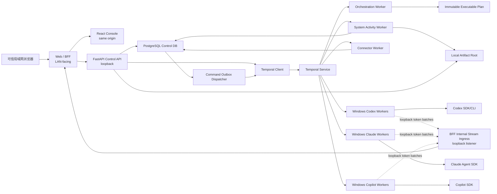

# Multi-Agent Platform V2 架构设计

> 状态：Draft / 待评审
> 目标：允许彻底重构，不保留 V1 兼容层，以成熟、稳定、可长期维护的基础设施替代自研可靠执行内核。
> 核心决策：Temporal 负责持久化工作流执行；应用只拥有业务控制面、工作流 DSL、Agent 执行契约和安全治理。
> 部署边界：可信局域网内无登录访问；所有 Agent、工作区和基础服务只运行在同一台 Windows 主机。

## 1. 执行摘要

V2 不再把自身定位为通用 Agent Framework，而是一个面向编码 Agent 的控制平台：

- Temporal 是唯一的持久化工作流运行时，负责历史、恢复、Timer、Signal、Update、Activity、重试、取消和 Worker 调度。
- PostgreSQL 是控制面配置、事件 Inbox、命令 Outbox、审计投影和执行租约数据库。
- Codex、Claude、Copilot 等本地 Agent 通过统一的 `AgentRuntime` 插件执行，但保留各自模型、会话、权限和取消语义。
- CloudEvents 是外部和内部业务事件的标准信封。
- LangGraph 与 Microsoft Agent Framework 不作为 V2 核心持久化引擎；它们只能作为可选 Agent Runtime 或工作流编写适配层。
- React 前端继续保持独立目录，正式运行时由同源 Web/BFF 暴露给局域网，只通过 Control API 和事件流读取投影、提交命令。

V2 删除以下自研基础设施：

- 自研 DAG 生命周期调度器和运行恢复器。
- APScheduler 持久化恢复逻辑。
- 自研长时间 Timer、状态机恢复和后台监督协程。
- 自研工作流 checkpoint。
- 以 SQLite 作为运行期执行状态数据库。

V2 继续拥有以下产品能力：

- 模板、版本、实例和审批语义。
- 任务级显式 Provider、模型、推理等级和工作区访问权限。
- 编码 Agent SDK 的生命周期、会话、流式事件、取消和权限映射。
- Git/Webhook/Cron/内部事件触发规则。
- 输入输出 JSON Schema、事件版本、操作记录和 UI。
- Pi 的非侵入式契约顾问边界。

## 2. 设计目标

### 2.1 目标

1. Worker、Control API 或宿主机重启后，工作流从持久化历史恢复。
2. 支持 DAG、状态机、条件分支、并行、等待外部事件、人工审批、Timer、补偿和子工作流。
3. Provider、模型、推理等级必须由每个 Agent 节点显式声明。
4. 不同 Provider 和不同任务能够真正并行；同一资源的冲突由隔离或明确协调解决。
5. 所有外部副作用具有幂等键、重放策略和人工处置路径。
6. 所有服务和 Agent 在同一台 Windows 主机运行；只有 Web/BFF 对可信局域网开放。
7. 支持可恢复的实时 UI、人工审批和操作记录。
8. 核心只依赖稳定版本；预览功能必须隔离在可卸载插件中。

### 2.2 非目标

- 不统一不同编码 Agent 的全部原生参数。
- 不承诺外部模型调用的物理 exactly-once；目标是通过幂等键和对账实现 effectively-once。
- 不把 LLM 设为全局调度器。
- 不允许模板直接包含任意 Python、Shell 或本机绝对路径。
- 不让 LangGraph、Microsoft Agent Framework 或 Pi 成为第二套执行状态源。
- 不支持远程 Agent、A2A、跨主机 Worker、互联网暴露或多租户隔离。
- 不提供登录、账号、角色或可验证的操作者身份。

## 3. 技术选型

| 领域 | 选型 | 用途 | 稳定性边界 |
| --- | --- | --- | --- |
| Durable Workflow | Temporal | 工作流历史、恢复、Activity、Signal、Update、Timer、Schedule、取消、Worker | V2 核心 |
| Web/BFF + Control API | FastAPI + Pydantic | 同源页面、HTTP、OpenAPI、命令和查询 | 唯一局域网入口；无编排逻辑 |
| Control DB | PostgreSQL | 模板、配置、Inbox、Outbox、投影、审批、执行租约 | 不决定工作流推进 |
| ORM/Migration | SQLAlchemy 2 + Alembic | 数据访问和 schema migration | 禁止运行时自动改表 |
| Workflow Validation | Pydantic + JSON Schema + NetworkX | DSL 解析、契约校验、DAG 验证 | 不执行任务 |
| Mapping/Condition | JMESPath | 输入映射和受限条件表达式 | 禁止 `eval` |
| Event Envelope | CloudEvents 1.0 | Git、Webhook、内部事件统一信封 | payload 另行版本化 |
| Live Stream | Web/BFF 内存 Stream Hub + PostgreSQL | Token 临时转发；里程碑持久化与重放 | Token 非状态真相源 |
| Artifact Store | 本机文件系统 | 大输出、原始日志、补丁和附件 | PostgreSQL 只存元数据和引用 |
| Observability | OpenTelemetry + structlog | trace、metric、log correlation | 首版无强制外部观测服务；Temporal UI 用于执行诊断 |
| Frontend | React + TypeScript + Ant Design + React Flow | 控制台和可视化编辑器 | 独立目录构建，由 BFF 同源发布 |

### 3.1 为什么选择 Temporal

Temporal 负责最难且最不应自研的部分：持久化执行历史、崩溃恢复、耐久 Timer、Activity 重试、Signal、Update、Schedule、取消、Worker 和安全部署版本。工作流代码必须确定性，所有 I/O 进入 Activity。

Temporal Workflow 是执行状态的唯一事实源。PostgreSQL 中的实例和节点状态是查询投影，不反向驱动执行。

### 3.2 为什么不以 LangGraph 为唯一底座

LangGraph 适合 Agent 图和状态流，后续可以作为工作流编写层。但 V2 首版不采用它作为可靠执行核心：

- 避免 LangGraph checkpoint 与应用/Temporal 形成双状态源。
- Temporal 官方 LangGraph 插件当前仍是 Public Preview。
- 编码 Agent 本身已有 Provider 原生工具循环，首版不需要再包一层 Agent loop。

插件稳定后，可增加 `LangGraphPlanCompiler` 或 Temporal 官方 LangGraph 插件；届时仍由 Temporal 提供 durability，禁止外部 LangGraph checkpointer。

### 3.3 Microsoft Agent Framework 的定位

Microsoft Agent Framework 可作为可选的本地 `AgentRuntime`，用于 Microsoft/Foundry Agent 或 Agent Harness。其 Workflow 不与 Temporal Workflow 同时承担同一实例的执行推进。

当项目明确采用 Azure Durable Extension，并且通过本项目的兼容性测试后，可以单独评审替换 Temporal；首版不同时维护两个 Durable Workflow 引擎。

## 4. 总体架构



网络边界：只有 Web/BFF 的 public listener 监听局域网地址；同一 BFF 进程另开一个仅绑定 `127.0.0.1` 的 internal stream listener，并共享进程内 Stream Hub。Control API、Temporal、PostgreSQL 和 Worker 默认只监听回环地址。正式运行时前端静态文件与 API/SSE 同源，避免额外开放跨域接口。Agent Worker 只能通过 internal listener 批量推送 token。

## 5. 服务与包边界

建议新建 V2 目录，验收完成前不在 V1 内做兼容改造：

```text
multi-agent-v2/
  apps/
    control_api/
    command_dispatcher/
    connector_service/
  workers/
    orchestration/
    system_activities/
    agent_windows/
  packages/
    domain/
    workflow_dsl/
    workflow_runtime/
    agent_runtime/
    eventing/
    persistence/
    policy/
    observability/
  deploy/
    local/
  tests/
    unit/
    contract/
    integration/
    chaos/

multi-agent-web-v2/
  frontend/
  bff/
```

边界规则：

- `domain` 不依赖 FastAPI、Temporal、Provider SDK、SQLAlchemy 或前端。
- `workflow_dsl` 只负责解析、校验和编译。
- `workflow_runtime` 是 Temporal Workflow 代码，只能调用确定性函数和 Temporal API。
- `agent_runtime` 是 Activity 侧接口，可以使用网络、文件和 Provider SDK。
- Control API 不导入 Provider SDK。
- 前端不导入核心 Python 包。
- Connector 不能直接调用 Agent；它只能写入 Event Inbox 或发送 Temporal command。

## 6. 数据所有权与事实源

| 数据 | 权威来源 | PostgreSQL 角色 |
| --- | --- | --- |
| 模板、模板版本 | PostgreSQL | 权威 |
| Trigger/Schedule 定义 | PostgreSQL | 权威 |
| Workflow 执行推进 | Temporal History | 查询投影 |
| Node 状态 | Temporal Workflow state | 查询投影 |
| 审批决定 | Temporal Signal/Update history | 审计投影 |
| Agent 外部执行租约 | PostgreSQL | 权威，用于副作用去重和对账 |
| 实时 token | Web/BFF 内存 Stream Hub | 有界、临时传输，不是终态，不保证跨重启重放 |
| 执行里程碑 | PostgreSQL `workflow_events` | 权威；以单调 event ID 支持 SSE 重放 |
| 最终输出和大文件 | 本机 Artifact Root | 权威 artifact；PostgreSQL 存元数据、哈希和引用 |
| 外部事件去重 | PostgreSQL Inbox | 权威 |
| 启动命令投递 | PostgreSQL Outbox + Temporal Workflow ID | effectively-once |

Temporal 自身持久化库与平台 Control DB 使用同一本机 PostgreSQL 实例中的独立 database/schema；应用不得读取或写入 Temporal 内部表。

数据库角色也必须隔离：一次性 bootstrap 管理员只负责初始化；`temporal_runtime` 只拥有 Temporal/visibility 数据库；`multi_agent_app` 只拥有 Control DB，并撤销其对 Temporal 数据库的连接权限。

禁止：

- PostgreSQL 和 Temporal 各自独立推进同一节点。
- 前端通过修改数据库纠正工作流状态。
- Workflow 在重放期间查询 PostgreSQL、文件系统、系统时间或网络。
- 将 token 流逐条写入 Temporal History。

### 6.1 命令一致性

命令按权威来源分为三类：

1. **PostgreSQL 配置命令**：模板、Trigger、Schedule 配置先在 PostgreSQL 事务中写入配置和 Command Outbox，再由 Dispatcher 同步到 Temporal。API 不绕过 Outbox 直接创建同一资源。
2. **Workflow 启动命令**：实例占位记录、触发因果和 StartWorkflowCommand 在同一 PostgreSQL 事务提交；Dispatcher 使用确定性 workflow ID 调用 Temporal，重复调用按 workflow ID 幂等收敛。
3. **运行中 Workflow 命令**：审批、取消、Signal 和 Update 直接以 Temporal 为权威入口，不先写 PostgreSQL 状态。Temporal 接受命令后，由投影事件更新 PostgreSQL；Update ID/Signal command ID 用于去重。

同步 API 如果必须返回命令校验结果，使用 Temporal Update；无需同步结果的外部事件使用 Signal。查询列表默认读取 PostgreSQL 投影，强一致的单实例当前状态可以读取 Temporal Query。

## 7. 工作流定义、编译和 IR

### 7.1 外部 DSL

模板使用 JSON 为规范格式，YAML 只作为导入格式。示例：

```yaml
apiVersion: orchestration.misaka.dev/v1
kind: Workflow
metadata:
  id: code-review
  version: 1
  name: Code Review
spec:
  inputSchema: {}
  outputSchema: {}
  failurePolicy: continue-independent
  nodes:
    - id: inspect
      type: agent
      agent:
        provider: codex
        model: sensenova/deepseek-v4-flash
        effort: high
        workspaceId: repo
        access: read_only
        prompt: "Inspect the repository"
    - id: approve
      type: approval
      approval:
        label: "人工确认"
        timeout: P7D
  edges:
    - from: inspect
      to: approve
```

### 7.2 节点类型

- `agent`：调用同一台主机上的编码 Agent。
- `activity`：调用注册的确定性业务 Activity 名称。
- `decision`：用 JMESPath 对已有状态做纯判断。
- `approval`：等待带可选操作者标签和原因的 Temporal Update/Signal。
- `wait_event`：等待具有 correlation key 的 CloudEvent。
- `timer`：耐久等待相对或绝对时间。
- `subworkflow`：启动固定版本的子工作流。
- `fanout`：对有界集合启动并行节点或子工作流。
- `join`：按 all/any/quorum 聚合。
- `compensation`：登记或执行 Saga 补偿。

### 7.3 编译流程

```text
JSON/YAML
  -> Pydantic structural validation
  -> JSON Schema input/output validation
  -> node type registry validation
  -> Provider/model/workspace/policy validation
  -> NetworkX graph validation
  -> JMESPath expression compilation
  -> immutable ExecutablePlan
  -> canonical JSON + SHA-256 plan hash
```

`ExecutablePlan` 必须：

- 完全可序列化。
- 不包含任意 Python callable。
- 固定 Provider、模型、effort、权限和 schema。
- 固定所有节点类型版本。
- 在实例启动时作为不可变输入进入 Temporal。

### 7.4 DAG 与状态机

外部可以提供 `dag` 和 `state_machine` 两种编辑体验，但二者编译为统一 IR：

- DAG 的 transition 由依赖完成触发。
- 状态机的 transition 由结果、Signal、CloudEvent 或 Timer 触发。
- 每次激活使用 `node_id + activation` 标识。
- 循环必须声明最大激活次数或 Continue-As-New 策略。

## 8. Temporal 执行模型

### 8.1 Workflow

`WorkflowInstanceWorkflow` 负责：

- 维护不可变 plan 和当前节点状态。
- 计算 ready nodes。
- 并行启动 Activity 或 Child Workflow。
- 等待审批、外部事件和 Timer。
- 执行失败传播、补偿和最终状态归约。
- 暴露 Query、Signal 和 Update。
- 在历史接近阈值时 Continue-As-New。

Workflow 内禁止：

- Provider 调用。
- SQL 查询。
- 文件访问。
- Git 操作。
- HTTP、Provider 或其他外部调用。
- 不确定随机数或系统时间。

### 8.2 Activity

主要 Activity：

- `execute_agent`
- `prepare_workspace`
- `cleanup_workspace`
- `publish_projection_event`
- `store_artifact`
- `ingest_cloud_event`
- `poll_git_ref`
- `reconcile_agent_execution`
- `run_registered_activity`

Activity 必须配置：

- `start_to_close_timeout`
- 可选 `schedule_to_close_timeout`
- heartbeat timeout
- cancellation handling
- 明确 RetryPolicy
- idempotency key

### 8.3 人工审批和外部事件

- Query：读取当前审批、节点和等待状态。
- Signal：异步提交外部事件或取消请求。
- Update：需要同步校验和返回结果的审批、重试、跳过、修订命令。
- Update ID 用于命令去重。

### 8.4 长时间执行

- 使用 durable Timer，不使用常驻 `asyncio.sleep` 进程。
- 使用 Continue-As-New 控制历史大小。
- 大输出使用 artifact reference，不进入历史。
- Token 由 Agent Worker 通过回环接口批量推送到 Web/BFF 内存 Stream Hub，不逐 token 进入 Temporal History；BFF 重启后允许丢失 token 片段，但最终输出和里程碑必须可恢复。

## 9. Agent Runtime

### 9.1 稳定接口

```python
class AgentRuntime(Protocol):
    name: str

    async def describe(self) -> AgentRuntimeCapabilities: ...
    async def list_models(self) -> list[ModelSpec]: ...
    async def start(self, request: AgentExecutionRequest) -> AgentHandle: ...
    async def stream(self, handle: AgentHandle) -> AsyncIterator[AgentEvent]: ...
    async def resume(self, request: AgentResumeRequest) -> AgentHandle: ...
    async def steer(self, handle: AgentHandle, message: str) -> None: ...
    async def cancel(self, handle: AgentHandle) -> None: ...
    async def reconcile(self, execution_id: str) -> ReconcileResult: ...
```

初始插件：

- `CodexRuntime`
- `ClaudeRuntime`
- `CopilotRuntime`
- `FakeRuntime`

候选插件：

- `MicrosoftAgentFrameworkRuntime`
- `LangGraphAgentRuntime`

### 9.2 AgentExecutionRequest

必须包含：

- `execution_id`
- `workflow_instance_id`
- `node_id`
- `activation`
- `attempt`
- `provider`
- `model`
- `effort`
- `workspace_id`
- `access_mode`
- `session_mode`
- `provider_session_id`
- `prompt`
- `input_artifacts`
- `output_schema`
- `timeout`
- `idempotency_key`
- `policy_context`

禁止使用 Provider 默认模型。模型和 effort 必须在编译期和 Activity 开始前验证。

### 9.3 Activity 重试和外部副作用

Temporal Activity 是至少一次执行。编码 Agent 调用不能假设 exactly-once：

1. Activity 开始时通过 `execution_id` 原子获取 PostgreSQL 执行租约。
2. Provider session/thread 创建后立即持久化原生 ID。
3. heartbeat 持续记录阶段、session ID 和最近事件序号。
4. Activity 重试先调用 `reconcile(execution_id)`，不能直接创建新 Agent。
5. `read_only` 且可安全重放的任务可以自动重试。
6. `workspace_write` 默认 `maximum_attempts=1`；失败后进入显式对账或人工重试。
7. 所有输出事件携带 `execution_id + sequence`，消费者按该键去重。

无法避免的失败窗口必须显示为 `reconciliation_required`，不能伪装成成功或自动启动第二个写任务。

## 10. 工作区与代码安全

- 服务端维护 `workspace_id -> root`，模板不能携带任意路径。
- 每次写任务默认创建独立 Git worktree。
- 读任务可以共享只读快照。
- 合并、提交、推送是独立高权限 Activity；默认不注册 push。
- 相同目标分支的合并操作通过专用 Resource Workflow 串行化。
- Worker 以低权限账户运行。
- 工具权限在 Provider Adapter 内映射，但最终决策来自平台 Policy。
- 原始 Provider 事件和补丁先写入 Artifact Root，再由脱敏器生成 UI 版本。
- Provider 凭据只来自本机 Agent/CLI 自身配置；模板、API 和数据库不接收或保存 Provider API Key。

## 11. 事件、Trigger 与 Schedule

### 11.1 CloudEvents 信封

统一字段：

- `specversion`
- `id`
- `source`
- `type`
- `subject`
- `time`
- `datacontenttype`
- `dataschema`
- `data`

业务事件类型仍采用显式版本，例如：

- `dev.misaka.git.commit.updated.v1`
- `dev.misaka.webhook.received.v1`
- `dev.misaka.workflow.completed.v1`
- `dev.misaka.agent.execution.failed.v1`

### 11.2 Inbox 与 Outbox

外部事件：

1. Connector/Webhook 校验来源策略、可选签名和 payload 大小。
2. PostgreSQL Inbox 以 `source + id` 去重。
3. Binding Router 产生一个或多个 `StartWorkflowCommand`。
4. 同一事务写入 Command Outbox。
5. Dispatcher 以确定性 Temporal Workflow ID 启动实例。
6. 重复启动按同一 workflow ID 幂等处理。

内部工作流推进不经过应用 Outbox；Temporal History 已经提供 durability。只有跨 PostgreSQL/Temporal 边界的命令使用 Outbox。

### 11.3 等待事件的关联

`wait_event` 节点不能依赖 Worker 内存注册：

1. Workflow 进入等待状态时，通过幂等 Activity 写入 `event_wait_subscriptions`，包含 workflow ID、node ID、event type、subject/correlation key 和有效期。
2. CloudEvent Inbox 提交后，Binding Router 同时匹配“启动新实例”的 Trigger 和“唤醒已有实例”的 subscription。
3. 命中的唤醒请求与 delivery 记录在同一事务写入 SignalCommand Outbox。
4. Dispatcher 使用确定性 command ID 向目标 Temporal Workflow 发送 Signal。
5. Workflow 消费 Signal 后通过 Activity 关闭 subscription；重复 Signal 由 command ID 和 Workflow 内已消费集合去重。
6. Workflow 取消、结束或 Continue-As-New 时必须转移或清理 subscription。

### 11.4 Schedule

- Cron、interval 和 calendar schedule 使用 Temporal Schedule。
- one-time 使用延迟启动或 durable Timer。
- Schedule 定义保存在 PostgreSQL；Temporal Schedule ID 使用平台 schedule ID。
- 创建、更新、暂停、恢复采用版本检查和幂等 command。
- Git 定时检测由 Schedule 启动 Connector Workflow，结果重新进入 CloudEvents Inbox。

## 12. Control API

### 12.1 Command API

- `POST /api/v2/templates`
- `POST /api/v2/templates/{id}/versions`
- `POST /api/v2/templates/{id}/instances`
- `POST /api/v2/instances/{id}/cancel`
- `POST /api/v2/instances/{id}/signals`
- `POST /api/v2/instances/{id}/updates/{name}`
- `POST /api/v2/approvals/{id}/decision`
- `POST /api/v2/triggers`
- `POST /api/v2/schedules`
- `POST /api/v2/events`

所有创建和命令接口接受 `Idempotency-Key`。

### 12.2 Query API

- 模板、版本和编译结果。
- 实例、节点、attempt、审批和 artifact 投影。
- Worker、task queue 和 Provider catalog 健康。
- Trigger delivery 和 Connector 状态。
- Temporal workflow link 和 trace link。

### 12.3 Streaming API

- SSE 是默认浏览器协议。
- 客户端使用 `Last-Event-ID` 恢复。
- Web/BFF 从进程内 Stream Hub 获取当前 token，从 PostgreSQL 补齐持久化里程碑。
- Token 重复允许按 `execution_id + sequence` 去重。
- Stream Hub 使用有界订阅队列和背压；浏览器断开或 BFF 重启后不承诺补发 token，但必须通过 `Last-Event-ID` 恢复所有持久化里程碑与最终输出。

## 13. PostgreSQL 模型

核心表：

- `workflow_templates`
- `workflow_template_versions`
- `workflow_instance_projection`
- `workflow_node_projection`
- `execution_attempt_projection`
- `approval_projection`
- `workflow_events`
- `agent_execution_leases`
- `provider_sessions`
- `artifacts`
- `event_inbox`
- `trigger_definitions`
- `trigger_deliveries`
- `schedule_definitions`
- `command_outbox`
- `audit_log`

规则：

- 领域实体使用 UUID/ULID 和 `created_at`/`updated_at`；`workflow_events` 另有单调递增的 `delivery_id` 供 SSE `Last-Event-ID` 使用。
- 配置表使用乐观版本。
- projection event 使用全局唯一 event ID 幂等写入。
- JSONB 只承载版本化 payload，不代替必要索引列。
- Alembic migration 必须前向演进并经过空库与升级测试。
- `artifacts` 保存相对路径、内容哈希、大小、媒体类型和保留期；文件以临时文件写入后原子 rename，禁止记录任意绝对路径。

## 14. 可信局域网边界

本项目不提供登录、账号、角色或身份认证。能够访问局域网页面的用户都可以创建、运行、审批和取消任务，因此局域网本身是信任边界，而不是安全的互联网边界。

控制：

- 只有 Web/BFF 监听配置的局域网地址；Control API、Temporal、PostgreSQL 和 Worker 只监听回环地址。
- 正式运行时 React 静态资源、API 和 SSE 使用同一 origin；默认不启用 CORS，并拒绝不符合 allowlist 的 `Host`、`Origin` 和浏览器跨站写请求。
- 开发模式的 Vite HMR 是显式开关，仅用于可信局域网调试；不得因此让核心 API 对局域网直接监听。
- 允许记录可选的 `operator_label` 和操作理由，但它们只是用户输入的元数据，不代表已验证身份，不能用于授权或不可抵赖审计。
- Provider Token 只由本机 Agent/CLI 配置管理，不进入模板、API 请求、Temporal input、数据库或日志。
- Webhook 支持 HMAC、时间戳、nonce、来源网段和 payload 限制；若允许其他局域网主机调用，建议强制 HMAC。
- 工作区、Artifact Root 和 Provider 可执行文件使用服务端 allowlist；API 不接受任意本机路径或命令。
- 写代码、高权限 Git 操作使用独立 task queue 和策略；默认不注册 push。
- 服务不得绑定公网地址、配置公网反向代理或自动建立外部隧道。

如果未来需要跨不可信网络或区分用户权限，必须重新设计认证、授权和审计，不能把 `operator_label` 升级为身份机制。

## 15. 可观测性

所有组件传播：

- `trace_id`
- `workflow_instance_id`
- `temporal_workflow_id`
- `temporal_run_id`
- `node_id`
- `execution_id`
- `provider_session_id`
- `event_id`

指标：

- Workflow start/complete/fail/cancel latency。
- Activity retry、timeout、heartbeat timeout。
- Task queue backlog 和 poller 数。
- Provider 请求、token、成本、错误类型。
- 审批等待时间。
- Trigger delivery lag。
- Outbox oldest age。
- Workspace/worktree 数和清理失败。
- Stream Hub 丢弃量、缓冲占用和客户端断开数。
- Artifact Root 容量、写入失败和清理失败。

健康检查必须拆分：

- `/live`：进程存活。
- `/ready`：依赖可用且可接收流量。
- `/health/components`：Temporal、PostgreSQL、Artifact Root、Provider workers 和 BFF Stream Hub 的详细状态。

历史错误不直接决定 readiness；只有当前未恢复故障影响 readiness。

首版写结构化日志并初始化 OpenTelemetry SDK，不强制启动 Collector、Prometheus 或 Grafana；需要长期指标时再配置可卸载 exporter。

## 16. 本机部署拓扑

### 16.1 运行组件

- Temporal 与 PostgreSQL 通过本机 Docker Compose 运行，只绑定回环地址；镜像必须精确锁定版本。
- Windows 宿主运行 Web/BFF、Control API、Dispatcher、Connector、Orchestration Worker、System Worker 和 Agent Worker。
- Artifact Root 是 Windows 本机受控目录，配置容量、单文件上限和保留周期。
- 正式运行时 Web/BFF 同源提供 React 静态文件、API 与 SSE，是唯一监听局域网的组件。
- 开发时可显式启动 React Vite HMR；其监听地址和端口必须在启动日志中清晰显示。

启动脚本只负责启动和监督，不迁移或删除数据。依赖初始化由显式 bootstrap/migration 命令完成。

启动验收必须有总超时、逐组件日志和失败退出码；脚本退出时关闭由本次启动创建的子进程，不能留下占用端口的后台服务。

Worker task queue：

- `orchestration-v2`
- `system-activities-v2`
- `connector-v2`
- `agent-codex-windows-v2`
- `agent-claude-windows-v2`
- `agent-copilot-windows-v2`
- `privileged-git-v2`

## 17. 失败语义

| 场景 | 处理 |
| --- | --- |
| Control API 崩溃 | Temporal Workflow 和 Worker 继续；API 恢复后重建查询能力 |
| Worker 崩溃 | Activity heartbeat timeout 后重投或进入对账 |
| Temporal 暂时不可用 | Control command 留在 PostgreSQL Outbox，恢复后重试 |
| PostgreSQL 暂时不可用 | Temporal History 保持安全；需要 DB 的投影、租约或事件 Activity 暂停并重试，纯 Timer/Signal 状态不丢失 |
| Provider 断线 | Activity 对账 session；按任务策略重试或等待人工 |
| 写任务状态不确定 | `reconciliation_required`，禁止自动启动第二个写任务 |
| Approval 等待数天 | Workflow durable wait，不占 Worker |
| Cron 服务重启 | Temporal Schedule 继续存在 |
| BFF 重启或浏览器断线 | 允许丢失中间 token；从 PostgreSQL 恢复里程碑，从 Artifact Root 读取最终输出 |
| Artifact Root 不可写或容量不足 | Artifact Activity 失败并重试；不返回虚假成功 |

## 18. 测试策略

### 18.1 单元测试

- DSL 和 IR 属性测试。
- DAG 环、不可达节点、非法 transition、schema 和 JMESPath。
- Provider contract、event mapping、policy 和 redaction。

### 18.2 Temporal 测试

- time-skipping 测试 Timer 和长时间审批。
- Workflow replay 测试确定性。
- Workflow versioning 测试旧历史可重放。
- Activity retry、heartbeat、cancel 和 timeout。

### 18.3 Contract 测试

每个 AgentRuntime 必须通过同一套测试：

- 显式模型和 effort。
- new/resume session。
- stream sequence。
- cancel/steer/approval。
- read-only/workspace-write 权限。
- schema output。
- crash/reconcile。

### 18.4 Chaos 测试

- 在 Agent 启动前、启动后、session ID 持久化前后杀死 Worker。
- 重启 Temporal、PostgreSQL、Web/BFF、Control API。
- 网络分区和重复 CloudEvent。
- Outbox 重复投递。
- BFF 重启后验证 token 可丢失但里程碑和最终结果完整。
- 端口暴露测试验证只有 Web/BFF 可从局域网访问，核心依赖只能从本机访问。
- 持续运行和 Continue-As-New。

### 18.5 真实 Provider 测试

- 默认 CI 只运行 Fake。
- 真实测试必须使用显式环境开关。
- 模型和 effort 必须显式传入。
- 真实写测试使用临时 worktree。
- 测试完成必须关闭 SDK/CLI、清理 worktree 和进程。

## 19. 迁移与实施阶段

V2 不保留 V1 API、数据库或内部类型兼容性。

### Phase 0：冻结与契约

- 冻结 V1 新功能。
- 把现有 98+ Fake 测试整理为行为验收清单。
- 完成 ADR、威胁模型和容量目标。

### Phase 1：基础设施骨架

- 新建 V2 目录。
- Temporal、PostgreSQL、Artifact Root 和组件健康检查；Stream Hub 在 Web/BFF 阶段实现。
- FastAPI `/live`、`/ready`。
- SQLAlchemy/Alembic 和 OpenTelemetry。

### Phase 2：DSL 与 Temporal Runtime

- Workflow DSL、编译器和 immutable IR。
- DAG、decision、join、approval、timer。
- Query、Signal、Update、cancel、Continue-As-New。

### Phase 3：Agent Runtime

- 先实现 FakeRuntime。
- 移植 CodexRuntime。
- 完成 execution lease、heartbeat、reconcile、worktree。
- 再接 Claude、Copilot。

### Phase 4：Control Plane 与事件

- 模板、实例、投影、Inbox/Outbox。
- CloudEvents、Webhook、Git connector、Temporal Schedule。
- 审批和审计。

### Phase 5：前端与局域网交付

- 新前端页面、同源 Web/BFF、进程内 Stream Hub 和 SSE。
- 启停脚本、端口约束、进程回收和健康检查。
- 可信局域网部署说明与网络暴露测试。

### Phase 6：稳定性与切换

- Chaos、恢复、容量和安全验收。
- V1/V2 不双写；使用独立测试数据完成验收。
- 停止 V1 服务，归档旧 SQLite，切换 V2。
- 删除 V1 运行代码，不保留兼容路由。

### Phase 7：本机运行时加固与执行证据

- `ProcessRuntime` 统一平台拥有的本机子进程生命周期，使用显式 argv、cwd、env，
  禁止隐式 shell，并对输出和终止等待设置硬上限。
- Windows 优先使用 `KILL_ON_JOB_CLOSE` Job Object；终止无法确认时返回独立错误，
  不把“已请求取消”伪装为“进程树已停稳”。
- `SandboxAttestation` 分离请求策略和实际 enforcement。只读任务要求完整文件系统
  限制，拒绝网络的任务要求完整网络限制，能力不足时 fail closed。
- `agent_execution_events` 保存仅追加、连续且幂等的观察事实；它不推进 Workflow，
  不成为第二套执行状态机。
- Artifact 先写临时文件、flush/fsync、原子替换，再登记相对引用、SHA-256、大小、
  媒体类型和 execution 归属。读取时重新验证大小与哈希。
- Provider 实时 token 仍只进入有界 Stream Hub；持久化范围限于里程碑、终态、
  脱敏 Provider 事件和恢复证据。
- 平台自有工具统一经过 pre hook、单调 Guard、Approval、超时、output schema、
  post hook 和 Audit；该流水线不侵入 Provider 内部 Agent loop。
- 通用人工问答只通过 Temporal Update/Signal 形成耐久命令；进程内 Future 不是
  审批事实源。
- Webhook 和 Connector 只保存 `CredentialRef`，每次操作重新解析本机凭据值；
  Provider Key 继续由本机 Agent 管理。
- 动态子代理只建立身份、谱系、能力和资源预算契约；实际推进仍使用 Temporal
  Child Workflow 或现有节点模型。
- Event Catalog 从代码确定性生成，覆盖 Workflow command、Outbox、CloudEvent、
  projection、执行证据和预留契约。

Phase 7 的详细工作包、非目标和完成标准见
[V2.1 运行时加固计划](v2.1-runtime-hardening-plan.md)。

## 20. 验收门槛

V2 只有同时满足以下条件才允许替换 V1：

1. Fake 契约测试全部通过。
2. 并行 DAG、状态机、审批、Timer、Signal、子工作流全部通过 replay。
3. Worker 在 Agent 调用各关键窗口崩溃时，不产生不可见的重复写任务。
4. Temporal/Control API/PostgreSQL 分别重启后，状态能够收敛。
5. 任务必须显式传入模型和 effort；默认模型路径不存在。
6. 只有 Web/BFF 能从局域网访问；Temporal、PostgreSQL、Control API 和 Worker 不可被局域网直接连接。
7. 1000 个并发等待工作流不会占用 1000 个 Worker slot。
8. Token 流不会膨胀 Temporal History。
9. UI 切换页面后仍能通过投影和 Last-Event-ID 恢复运行状态。
10. 无遗留 Agent CLI、worktree 或服务进程。
11. 可信局域网边界审查、依赖锁定、SBOM 和 secret scan 通过。
12. V1 代码和兼容入口在切换后删除。

## 21. 依赖治理

- 使用 `uv.lock` 锁定 Python 完整依赖树。
- 核心依赖只接受稳定发布；preview 只能进入 optional extra。
- Provider SDK 精确锁定并运行 contract suite 后升级。
- 每月依赖升级 PR；Temporal SDK/Server 升级先跑 replay test。
- 生成 SBOM，执行漏洞和许可证扫描。
- 禁止核心域模型直接导入 Agent Framework 类型。

首批候选依赖：

```text
temporalio
fastapi
pydantic
sqlalchemy
alembic
asyncpg
jsonschema
networkx
jmespath
cloudevents
opentelemetry-api
opentelemetry-sdk
structlog
```

各本地 Agent SDK 作为独立 optional dependency group；核心依赖不安装未启用的 Provider SDK。

## 22. 已决策事项

- 允许完全重构，不保留 V1 兼容。
- Temporal 是 V2 唯一 Durable Workflow 引擎。
- PostgreSQL 不与 Temporal 竞争执行状态所有权。
- LangGraph/MAF 不是首版核心依赖。
- 显式 task model/effort 是不可放宽的契约。
- Pi 不生成执行图、不选择 Provider、不触发任务。
- 前端继续与核心解耦。
- 不提供登录；可信局域网内所有访问者拥有相同操作能力。
- 只调用同一台 Windows 主机上的本地 Agent，不支持远程 Agent 或跨主机 Worker。
- 只有同源 Web/BFF 对局域网开放，其余组件只监听回环地址。
- Token 流允许降级，最终输出、里程碑和工作流状态必须持久化。
- Temporal 与 Control DB 共用本机 PostgreSQL 实例中的独立 database/schema，并由 Docker Compose 提供可复现部署。

## 23. 待确认事项

1. V2 首个真实 Provider 是否仍从 Codex 开始。
2. Artifact Root、默认保留周期、总容量和单文件大小限制。
3. Web/BFF 默认监听的局域网地址和端口。
4. Webhook 是否允许其他局域网主机调用；若允许，首版是否强制 HMAC。

## 24. 参考资料

- [Temporal Documentation](https://docs.temporal.io/)
- [Temporal Python SDK](https://docs.temporal.io/develop/python)
- [Temporal Workflow message passing](https://docs.temporal.io/develop/python/workflows/message-passing)
- [Temporal Schedules](https://docs.temporal.io/develop/python/workflows/schedules)
- [Temporal Versioning](https://docs.temporal.io/develop/python/workflows/versioning)
- [Temporal LangGraph integration](https://docs.temporal.io/develop/python/integrations/langgraph)
- [LangGraph overview](https://docs.langchain.com/oss/python/langgraph/overview)
- [Microsoft Agent Framework overview](https://learn.microsoft.com/en-us/agent-framework/overview/)
- [Microsoft Agent Framework Durable Extension](https://learn.microsoft.com/en-us/agent-framework/integrations/durable-extension)
- [CloudEvents](https://cloudevents.io/)
