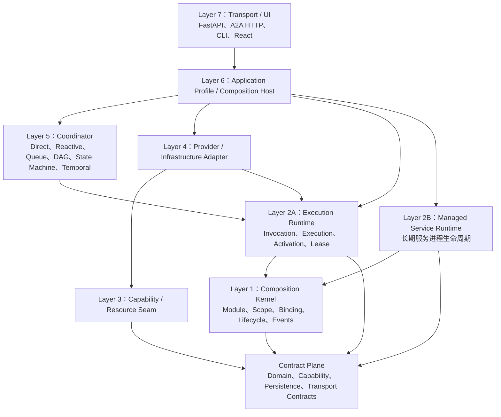

# Multi-Agent V3：领域优先架构

> 状态：Architecture baseline
> 日期：2026-08-19
> 规范性质：与当前包目录和实现状态无关
> 兼容性：不保留 V2 API、数据模型和运行时兼容层

## 1. 设计原则

V3 的架构由目标领域、生命周期不变量和可替换能力推导，不由当前代码目录反向决定。

设计顺序固定为：

```text
业务目标
  -> 领域对象
  -> 所有权和生命周期
  -> 不变量和失败语义
  -> Contract / Port
  -> Kernel / Runtime
  -> Provider / Adapter
  -> Coordinator
  -> Profile / Transport
```

当前实现只能用于发现已发生的失败模式和验证迁移结果，不能作为目标层次的规范。当前实现与目标架构的关系记录在独立的[实现迁移映射](implementation-map-v3.md)中。

V3 的核心不是 Workflow、DAG 或 Temporal，而是可独立发现、准入、调用、取消、观察、恢复和替换的能力模块。

## 2. 领域对象

### Capability

Capability 表示系统能够提供的能力集合。它包含稳定的能力 ID、版本、操作、输入输出 Schema、Feature 和生命周期语义。

### Invocation Intent

Invocation Intent 是一次不可变的逻辑请求，描述调用哪个能力、执行哪个操作、使用什么输入、完成边界和策略上下文。它不等于已经启动的外部进程。

### Principal / Scope

Principal 表示发起、控制、观察或批准一次操作的主体。主体可以是人、应用、Agent、服务或外部调用方。Scope 定义主体可见和可操作的资源范围。

Principal 是通用授权概念，不表示某一种 Agent 或 Transport。

### Execution

Execution 表示系统已经接纳并负责推进的一次 Invocation Intent。Execution 拥有状态、幂等身份、结果、事件、资源租约和恢复责任。

### Activation

Activation 是 Execution 的一次真实执行尝试或恢复纪元。一个 Execution 可以有多个历史 Activation，但同一时间最多只能有一个 live Activation。

### Provider Handle

Provider Handle 是 Provider 在当前进程中返回的临时控制句柄，不能作为跨进程恢复身份。

### Session

Session 是可跨多个 Execution 复用的上下文，拥有独立的 Session Header、事件日志、恢复规则和资源所有权。Provider Native Session 不能替代平台 Session。

### Delegation

Delegation 表示一个 Principal 将某项能力、输入和受限权限交给另一个 Provider 或执行主体。它拥有独立的身份、策略快照、生命周期、报告和恢复责任。

Delegation 可以是一次性的，也可以绑定一个可持续的 Session；它不是 `parent_invocation_id` 的别名，也不是 A2A Task 的别名。

### Interaction Channel

Interaction Channel 是两个或多个主体之间传递有序控制消息、问题、报告和确认的通用通道。它拥有消息序号、游标、投递状态、作用域和重放语义。

Interaction Message 被接受、投递、处理和完成是不同事实，不能用一个 Runtime Event 字符串替代。

### Decision Gate

Decision Gate 是产生外部副作用前的通用准入边界。它绑定提案版本、输入摘要、效果范围、策略约束和决策主体；决策通过后才能发布 Activation。

### Resource Lease

Resource Lease 表示对 Session、Workspace、Process、Artifact 或其他可冲突资源的排他控制。Lease 需要 owner、epoch、过期和 fencing 语义。

### Managed Service

Managed Service 是长期运行的服务进程，例如 A2A Node、Agent Host、MCP Server、Poller 或 Worker。它与一次 Execution 分属不同生命周期。

### Task / Job

Task 或 Job 是 A2A、Control Plane、CLI 或 Web 对 Execution 的协议包装或应用投影。它们不能在没有明确事实所有权的情况下独立推进另一套终态。

## 3. 核心不变量

### 生命周期不变量

- 一个 Execution 同一时间最多有一个 live Activation；
- 外部副作用已经开始但终态无法证明时，必须进入 `reconciliation_required`；
- 取消只有在 Provider 已确认停止后才能成为 `cancelled`；
- Provider Handle 丢失时不能盲目启动第二个写 Activation；
- `dispose` 必须等待工作、监听器、进程和子资源完全停稳。

### 所有权不变量

- Execution、Activation、Session、Job 和 Managed Service 都必须有明确 owner；
- Principal 的角色和 Scope 必须显式声明；知道一个 ID 不等于获得控制权；
- Lifecycle Scope 负责资源释放，Execution Scope 负责身份、可见性和授权；
- 迟到的旧 owner 不能修改新 epoch 的状态；
- 同一 Session 默认不得并行执行两个写 Activation。

### 能力不变量

- Provider 在产生外部副作用前完成能力协商；
- 不支持的 Feature、Schema、取消、恢复或策略必须显式拒绝；
- Provider 不能静默忽略请求字段；
- Provider 注册和策略注册必须是可撤销的生命周期副作用。

### 事实不变量

- Durable Fact 是恢复和审计的权威来源；
- Runtime Event 允许丢失，不能承担终态事实；
- Projection 必须能够从权威事实重建；
- Session、Execution、Task 和 Job 的事实所有者必须由 Profile 明确声明；
- Interaction Message 的 accepted、delivered、processed 和 completed 必须可以分别重放和审计；
- Decision Fact 必须绑定 plan revision、effect scope 和 decision principal；
- Secret、Token、凭据值和未脱敏环境变量不得进入 Fact、Event、Artifact 或日志。

## 4. 分层模型

Contracts 是横向契约平面。其上是 Kernel、Runtime、Seam、Provider/Adapter、Coordinator、Profile 和 Transport。



依赖箭头表示上层依赖下层公开 Contract 或 Port。它不限制异步消息、事件和 Provider 调用的运行时方向。

### Contract Plane

包含：

- Domain Contracts：Invocation、Execution、Activation、Session、Lease、Result；
- Capability Contracts：Agent、Delegation、Continuation、Interaction、Tool、Policy、Sandbox、Workspace、Process、Artifact；
- Persistence Contracts：Session Log、Execution Fact Store、Projection Store；
- Service Contracts：Managed Service Definition、Snapshot、Lifecycle Action；
- Transport Contracts：A2A Task、Agent Card、Interaction Message 和 HTTP-neutral DTO。

Contract Plane 不依赖 FastAPI、Temporal、数据库、Provider SDK、操作系统 API 或 UI。

### Layer 1：Composition Kernel

Kernel 负责：

- Module Manifest；
- HostContext；
- Service Binding Registry；
- Composition Snapshot；
- Lifecycle Scope；
- Effect/Disposer；
- Profile Loader；
- 依赖、版本、冲突和重复绑定验证；
- 事件注册和监听器生命周期；
- 启动失败回滚。

Kernel 不知道 Agent、A2A、Workflow、Codex、Temporal、PostgreSQL 或 Managed Service 业务语义。

Kernel Service 仅表示 Host 内依赖绑定，不表示操作系统服务。

### Layer 2A：Execution Runtime

Execution Runtime 负责：

- Invocation Intent 准入；
- Capability negotiation；
- Execution 和 Activation 生命周期；
- owner、lease、epoch 和 fencing；
- 幂等、取消、超时和重试；
- Provider Handle 管理；
- Durable Fact 写入；
- Runtime Event 规范化；
- Reconciliation；
- 资源释放和完成边界。

Execution Runtime 不读取 Workflow DSL，不选择 DAG 分支，不直接调用具体 Provider SDK。

Execution Runtime 只负责一次 Invocation 的事实和生命周期。持续交互、父子委派和消息通道通过现有 Seam/Coordinator 组合，不把某一种交互协议固化到 Execution 状态机。

### Layer 2B：Managed Service Runtime

Managed Service Runtime 负责长期服务进程：

- 静态或动态服务目录；
- 进程启动和停止；
- 健康检查；
- PID、启动 epoch 和日志；
- 进程树和子资源清理；
- 服务故障状态；
- graceful shutdown。

它不负责 Invocation、Task、Provider 选择或 Workflow 状态。

### Layer 3：Capability / Resource Seam

Seam 是稳定的能力或资源端口。

Invocation Capabilities：

- Agent Invocation；
- Delegation；
- Continuation / Interaction；
- Tool Execution；
- Event Source；
- Human Approval。

Resource Capabilities：

- Session Log；
- Workspace；
- Process；
- Artifact；
- Persistence；
- Resource Lease。

Policy Capabilities：

- Policy Decision；
- Sandbox / Execution Boundary；
- Credential Resolution；
- Settings / Configuration；
- Authorization。

### Layer 4：Provider / Infrastructure Adapter

Provider 和 Adapter 实现 Seam，例如：

- Codex、Fake、其他 Agent Provider；
- In-process、ACP、远程或 A2A Delegation Provider；
- Local Git、Remote Workspace、Windows Process；
- JSONL、PostgreSQL、SQLite、Memory Persistence；
- Filesystem、Object Storage Artifact；
- Git、Webhook、Cron Event Source；
- A2A HTTP/SSE、CLI、RPC Transport。

Provider 可以依赖 Seam Contract、Execution Runtime 和 Kernel Module API，但不得依赖 Coordinator、Profile 或 UI。

### Layer 5：Coordinator

Coordinator 只组合 Execution：

- Direct；
- Reactive；
- Queue；
- DAG；
- State Machine；
- Temporal Durable Coordinator。

Workflow 是可选 Coordinator，不是底层核心。移除 Workflow 不得影响 Agent、Delegation、Tool、A2A 或 Managed Service Runtime。

Delegation Controller 可以作为 Profile 或 Coordinator 内部的实现，负责把 Delegation、Session、Interaction Channel 和 Execution 组合起来；它不是 Kernel 必需层，也不定义新的领域事实。

### Layer 6：Application Profile / Composition Host

Profile 负责：

- 选择模块、Provider、Coordinator 和 Persistence；
- 组合配置层和 Provider Binding；
- 定义事实源、Projection 和恢复策略；
- 定义 owner 和权限边界；
- 建立启动、重载和停止顺序；
- 暴露应用级 API。

Profile 可以没有 Coordinator、Web、Temporal、PostgreSQL 或 Managed Service。

### Layer 7：Transport / UI

包括 FastAPI、A2A HTTP/SSE、CLI、MCP 和 React。Transport/UI 只能调用 Profile 暴露的 Port，不得提交任意 command、cwd、环境变量或 Provider SDK 对象。

面向主体的 Delegation Gateway 是一种 Transport/Port 适配，不是 Provider SDK 的直通层。

## 5. Delegation 与 A2A

Delegation 是能力；A2A 是一种协议和 Provider 适配。

```text
Delegation Seam
    -> one-shot provider
    -> continuable provider
    -> in-process / CLI provider
    -> remote / A2A provider

Delegation Controller（可选 Profile 实现）
    -> Session / Interaction Channel
    -> Execution Runtime
    -> Delegation Provider
```

Delegation Contract 的通用持续交互语义见 [Delegation、Continuation 与 Interaction Contract](delegation-continuation-v3.md)。它必须支持：

- one-shot 和 continuable 两种模式；
- parent/child owner；
- delegation depth；
- tool filter 和 persona；
- output schema；
- cancellation/dispose；
- child identity 和 projection；
- report back；
- 冷恢复和 Activation Reconciliation。

A2A Task、Delegation、Invocation、Activation、Session、Interaction Message 和 Job 必须分别建模。

Delegation 的持续交互必须使用通用 Continuation Contract：follow-up、steer、cancel、resume、reply、ack 和 reconcile。Provider 只提供外部协议适配，不能自行拥有父子授权、平台消息事实或全局终态。

## 6. 事件、事实和投影

事件分为四类：

| 类型 | 作用 |
|---|---|
| Durable Fact | 恢复、审计、幂等重放 |
| Runtime Event | 实时进度、观察、UI |
| Decision Event | 准入、策略、请求改写和阻断 |
| Projection Update | 从事实折叠出的查询视图 |

Event Source、EventDispatcher 和 Durable Event Store 不是同一个组件：

```text
Event Source -> Coordinator / Execution Runtime
Runtime Event -> EventDispatcher
Durable Fact -> Persistence Adapter
Projection -> Projection Store / Query API
```

事件 Contract 必须声明事件名、版本、模式、payload Schema、生产方、消费方、作用域和错误隔离规则。

Interaction Message 不是普通的观察事件：

```text
Interaction Message -> Message Store / Channel Cursor
Runtime Event       -> EventDispatcher
Decision Fact       -> Policy / Admission Fact Store
```

Message 的投递确认、处理确认和回复关联必须独立于 Runtime Event 的实时推送。

## 7. 横向机制

以下机制不是额外的业务层：

- Security / Admission；
- Sandbox / Execution Policy；
- Credential Resolution；
- Settings / Configuration Overlay；
- Observability；
- Invariant Diagnostics。

它们必须通过明确 Port 接入，不能通过 Provider 私有字段或全局变量实现。

## 8. 目标架构的禁止事项

- 不以当前 Python 包目录决定层次；
- 不让 Provider、Coordinator 或 Profile 成为事实源；
- 不让 Kernel 了解业务能力；
- 不让 Service Runtime 管理 Invocation；
- 不让 A2A 取代 Delegation；
- 不把 Codex、A2A 或某一种 Agent 会话写入核心领域 Contract；
- 不让 Task/Job 替代 Execution；
- 不把 `parent_invocation_id` 当作完整的 Delegation、授权或消息通道；
- 不让 Session Native ID 取代平台 Session Log；
- 不把 Interaction Message 当作无类型字符串事件；
- 不让没有 Sandbox 或 Credential 约束的请求静默执行；
- 不让不同事件域共享一个无类型的状态推进接口；
- 不把当前实现状态写入规范架构文档。
