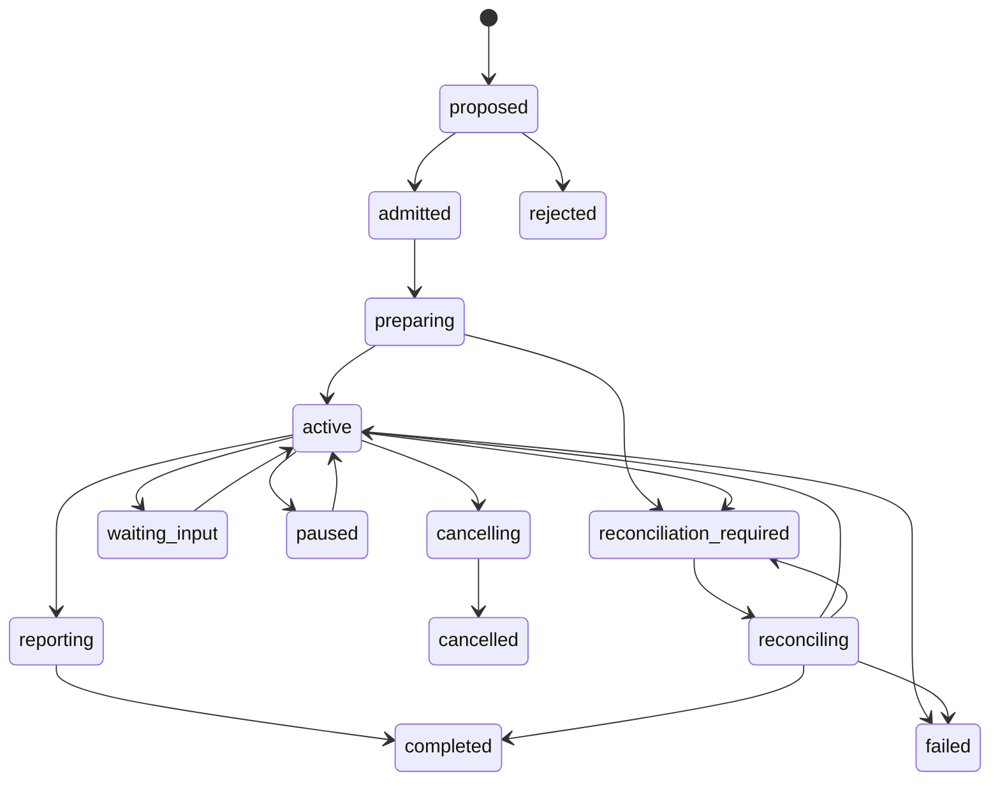

# V3 Delegation、Continuation 与 Interaction Contract

> 性质：通用 Contract 规范
> 约束：不依赖 Agent、Codex、A2A、Workflow、Transport 或具体 Provider

本文补充 [Capability Seam 与 Provider Contract](capability-seams-v3.md)、[Invocation / Execution 生命周期](invocation-lifecycle-v3.md) 和[领域优先总体架构](architecture-capability-first-v3.md)中关于持续调用、委派和有序交互的通用语义。

## 1. 适用范围

Delegation 表示一个 Principal 将能力和受限权限交给另一个执行主体。Continuation 表示同一个逻辑调用或 Session 可以在多个 Activation 之间继续。Interaction Channel 表示传递控制消息、问题、回答、报告和确认的可重放通道。

这三个概念可以组合，也可以独立使用：

```text
One-shot Invocation
    -> 不需要 Continuation

Continuable Invocation
    -> Session + Interaction Channel

Delegation
    -> Principal/Scope + child identity + policy + report
```

它们不是某种 Agent 协议的别名。

## 2. 对象关系

```text
Principal / Scope
    -> Delegation
        -> Session
            -> Interaction Channel
                -> Message Fact
        -> Invocation
            -> Execution
                -> Activation
                    -> Provider Handle
```

关键边界：

- Delegation 是授权和生命周期关系；
- Session 是可持续上下文；
- Channel 是消息事实的顺序和投递边界；
- Execution 是具体工作；
- Activation 是一次外部副作用尝试；
- Provider Handle 不能作为恢复身份。

## 3. Continuation Contract

支持 Continuation 的 Capability 至少声明以下操作：

```text
prepare
start
follow_up
steer
pause
resume
ack
cancel
close
reconcile
```

每个操作都必须声明：

- 输入和输出 Schema；
- 是否创建新的 Activation；
- 是否要求 Session Lease；
- 是否允许与现有 Activation 并行；
- 完成边界；
- 取消和恢复语义；
- 幂等键和冲突规则。

默认规则：同一 Session 同一时间最多一个 live write Activation。Follow-up 不得隐式创建第二个并行写 Activation。

### 3.1 Prepare 与 Start

如果 Provider 创建外部 Session 会产生副作用，必须将其拆分为：

```text
prepare session
    -> persist provider session reference
        -> start activation / turn
```

发生崩溃时，未确认的外部副作用必须进入 `reconciliation_required`，不能因为没有本地 Handle 就重新创建 Session。

### 3.2 Follow-up

Follow-up 必须指定：

```text
session_id
expected_activation_id
message_id
correlation_id
input
```

如果 Activation 已经结束，Follow-up 可以创建新的 Activation；如果 Activation 仍在运行，只有 Provider 明确支持 steer/interrupt-and-replace 时才能接受。

### 3.3 Local Delegation Runtime 的控制语义

Local Delegation Runtime 对上述操作采用显式门禁：

- `prepare` 只写入 `preparing` Activation Fact，不启动 Provider；`start` 必须携带匹配的 `expected_activation_id`，且不能替换 `prepare` 捕获的输入；
- `steer`、`pause` 和 `resume` 只有在 Execution Handle 声明同名控制方法时才接受，能力不足会 fail closed；
- `ack` 以 `reply_to` 指向被确认 Message，并将 ACK Message 与目标 Message 分别推进到 `completed`；
- `close` 只在没有 live Activation 时关闭 Interaction Channel；运行中的 Activation 必须先 `cancel` 或完成；
- `prepare` 后进程崩溃且本地 Prepared 引用丢失时，`start` 收敛到 `reconciliation_required`，不得创建第二个 Activation。

## 4. Interaction Message Contract

Message 是可寻址、可重放的 Durable Fact，不是只用于观察的 Runtime Event。

```text
message_id
channel_id
sender_principal
recipient_principal
message_type
payload_schema
correlation_id
causation_id
reply_to
sequence
scope
created_at
expires_at
```

通用消息类型包括：

```text
instruction
question
answer
progress
artifact
result
approval_request
approval_response
steer
cancel
ack
```

### 4.1 投递状态

平台必须区分：

```text
accepted
    -> delivered
        -> processed
            -> completed
```

其中：

- `accepted`：事实已写入 Message Store；
- `delivered`：目标消费者已取得消息；
- `processed`：消费者已确认处理；
- `completed`：消息要求的操作已经完成。

重复发送以 `message_id` 幂等；同一 Channel 的 sequence 单调递增；断线客户端使用 cursor 重放，不重新提交逻辑调用。

### 4.2 问题和回复

消费者可以发送 `question`，使关联 Operation 进入 `waiting_input` 或等价的非终态。

回复必须引用 `reply_to` 和 `correlation_id`。未回答的问题不能被普通 `progress` 事件覆盖，也不能通过新建一个无关联 Invocation 绕过。

`waiting_input` 是 Continuation/Delegation 的可选状态，不要求所有 Invocation Provider 都把它加入基础 Execution 状态机；Profile 必须声明该状态由哪个事实源拥有。

## 5. Delegation 生命周期



Delegation 终态不能只由最后一个子 Execution 的状态决定，还必须检查：

- 是否仍有 live Activation；
- 是否有未处理的 Message；
- 是否有未收取的报告；
- 是否完成资源释放；
- 是否存在待决 Decision Gate。

## 6. Decision Gate

具有外部副作用的 Delegation/Invocation 可以要求 Decision Gate。Decision Fact 至少绑定：

```text
proposal_id
plan_revision
plan_hash
requested_effects
resource_scope
policy_snapshot
decision_principal
decision
```

计划内容或效果范围发生变化时，必须创建新的 proposal revision。旧的批准不能自动覆盖新计划。

Decision Gate 是通用 Policy Capability，不属于 UI 或某一种 Agent 会话。

## 7. Owner、Scope 和预算

Delegation 至少声明：

```text
initiator
controller
observers
parent_scope
child_scope
delegation_depth
fan_out_limit
time_budget
resource_budget
```

主体拥有一个 ID 不代表其拥有控制权。Child 默认只能：

- 读取被授予的输入和资源；
- 写入自己的报告和声明的 Artifact；
- 向父 Scope 发送问题或状态；
- 执行被 Policy 明确允许的操作。

Child 不得自动获取父 Session 全部历史、兄弟 Child 的控制权或未声明的 Workspace。

## 8. Provider Adapter 边界

Provider 只负责外部系统能力：

- 创建或恢复 Native Session；
- 启动和消费 Activation；
- 发送 Provider 认可的输入；
- 取消、关闭和查询外部状态；
- 返回 Provider Operation/Session Reference。

Delegation、Message Store、Decision Fact、Owner/Scope 和平台终态由上层 Runtime/Seam 实现负责。

如果 Provider 不支持某项 Continuation、Attach、Cancellation 或 Reconciliation，必须在能力协商阶段显式声明或拒绝，不能静默降级。

## 9. Profile 组合

一个本地 Delegation Profile 可以这样组合：

```text
Composition Kernel
Execution Runtime
Delegation Seam implementation
Session Log
Interaction Channel
Decision Gate / Policy
Workspace / Artifact
Local Delegation Gateway
Provider Adapter
```

该 Profile 可以选择 In-process、CLI、HTTP、A2A 或其他 Provider；选择不改变 Contract Plane。

## 10. 验收门槛

至少验证：

1. 重复 Delegation 请求不会创建第二个逻辑 Delegation；
2. 同一 Session 不会出现两个 live write Activation；
3. Follow-up、reply、cancel 和 resume 都具备幂等键；
4. Message 可以按 cursor 重放；
5. Provider 崩溃后不会盲目创建第二个外部 Session 或 Activation；
6. 未通过 Decision Gate 的副作用会被拒绝；
7. Child 无法越过 owner/scope 读取或控制其他资源；
8. Projection 可以从 Delegation、Message 和 Execution Durable Facts 重建；
9. Provider 替换为 Fake 或另一种 Transport 后，Contract Test 仍然通过。

## 11. 非目标

- 不规定 Codex、A2A 或其他 Provider 的内部协议；
- 不要求所有 Profile 都支持 Continuation；
- 不要求所有 Delegation 都采用 Workflow、DAG 或 Temporal；
- 不把 Message Channel 变成无约束的全局消息总线；
- 不允许 Transport 直接修改 Execution Fact。
