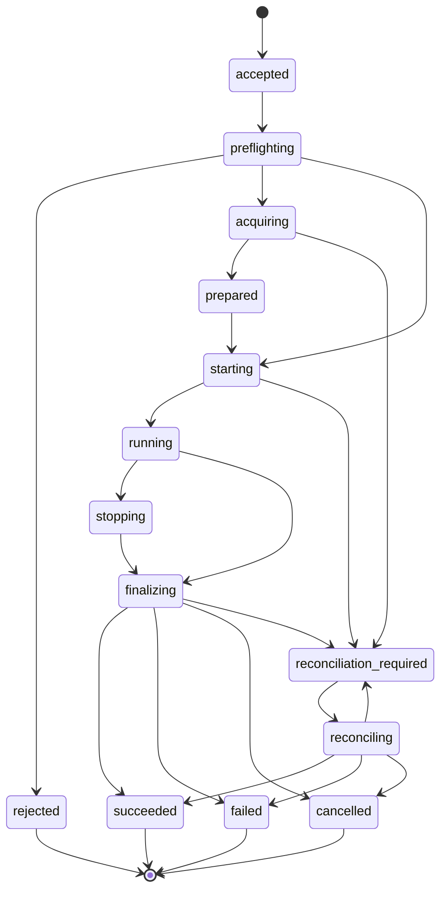

# V3 Invocation / Execution 生命周期

## 1. 对象关系

```text
Principal / Scope
    -> Delegation (optional)
        -> Session / Interaction Channel (optional)
            -> Task / Job / API Request
                -> Invocation Intent
                    -> Execution
                        -> zero or more historical Activations
                        -> at most one live Activation
                            -> Provider Handle
                                -> Runtime Events
```

Invocation Intent 是不可变请求；Execution 是平台负责推进的生命周期；Activation 是一次外部副作用尝试；Provider Handle 只是进程内句柄。

Task 和 Job 是协议包装或应用投影，不应各自创建另一套执行事实。Delegation、Session 和 Interaction Channel 也不能被某一个 Transport 的状态对象替代。

## 2. Execution 状态机



`acquiring` 和 `prepared` 只有在确实存在资源准备边界时才写入事实。没有资源准备阶段的 Provider 可以从 `preflighting` 直接进入 `starting`。

## 3. 请求、Execution 和 Activation 标识

```text
invocation_id       逻辑 Invocation Intent
execution_id        被平台接纳的执行记录
activation_id       一次外部执行尝试或恢复 epoch
attempt              当前投递尝试次数
provider_handle     进程内临时句柄
provider_session    Provider Native Session 引用
delegation_id       一次委派关系
session_id          平台 Session 身份
channel_id          Interaction Channel 身份
message_id          一条可重放的 Interaction Message
correlation_id      请求、回复和报告的关联身份
```

请求指纹只包含逻辑请求字段，不包含 Activity delivery attempt、Worker PID 或 Provider Handle。

`parent_invocation_id` 只能表达请求来源，不能替代 delegation、owner、scope 或 message channel。

## 4. Owner 和 Resource Lease

每个 Execution 必须关联：

```text
owner_id
scope_id
lease_owner
lease_epoch
resource_refs
```

Delegation/Interaction 还必须关联：

```text
initiator_principal
controller_principal
observer_scope
decision_ref
```

Lease 规则：

- 旧 epoch 不能写入新状态；
- lease 过期但外部副作用未确认时只能 reconcile；
- 续租和终态提交使用 compare-and-set；
- 同一 Session、Workspace 或 Process 资源不能由两个 live write Activation 同时占用；
- 释放失败不能把已成功的 Execution 改写为失败，但必须保留 cleanup 状态。

Lifecycle Scope 负责释放资源；Owner Scope 负责身份、可见性和授权。

## 5. Activation 发布边界

```text
prepare resources
  -> persist execution / activation identity
  -> start external operation
  -> persist provider operation identity
  -> publish running
```

崩溃窗口处理：

| 窗口 | 后继动作 |
|---|---|
| Execution 尚未持久化 | 可安全重试 |
| Activation 已持久化、外部启动前 | 可在 lease 过期后接管 |
| 外部启动已请求、Provider identity 未落库 | `reconciliation_required` |
| Provider 已运行、Handle 丢失 | attach 或人工 reconcile |
| Provider 已终态、Artifact 未提交 | 重新读取终态或人工对账 |
| 终态事实已写入、Activity 未完成 | 返回缓存终态，不重新启动 |

不能把“查不到 Provider”直接解释为“从未启动”。

## 6. Durable Facts、Runtime Events 和 Projection

### Durable Facts

```text
execution/accepted
execution/preflighting
execution/acquiring
execution/prepared
execution/started
execution/checkpoint
execution/stopping
execution/finalizing
execution/completed
execution/failed
execution/cancelled
execution/reconciliation-required
delegation/accepted
delegation/child-attached
delegation/report-received
delegation/completed
interaction/message-accepted
interaction/message-delivered
interaction/message-processed
interaction/message-completed
decision/proposed
decision/accepted
decision/rejected
```

Durable Fact 是恢复和审计依据，必须可排序、可重放、可幂等。

### Runtime Events

```text
execution/progress
agent/token
tool/output
resource/heartbeat
```

Runtime Event 可以丢失，不能决定终态。

### Projection

Projection 从 Durable Fact 折叠得到，必须携带 source revision 或 watermark。Projection 不得反向推进 Execution 事实。

## 7. Session 关系

Session 独立于 Execution：

```text
Session
    -> many serial Executions
        -> one live write Activation at a time
```

Session 必须拥有：

- immutable header；
- format version；
- parent/seed lineage；
- profile/capability composition identity；
- append-only event log；
- load/inspect/replay 语义；
- revision 和 projection watermark。

Session idle 不等于某个 Execution 完成。消息入队成功也不等于模型已经开始处理。

Interaction Message 的事实顺序必须明确区分：

```text
accepted -> delivered -> processed -> completed
```

任何阶段都可能因重启、取消或 Provider 不可达而停留在可恢复或需对账状态。

## 8. 取消和释放

取消流程：

```text
close admission
  -> request provider stop
  -> await provider termination
  -> finalize execution
  -> release resources
  -> publish terminal fact
```

只发送 interrupt、关闭 HTTP 连接或设置 cancelled 标志，都不能证明 Activation 已停止。

如果 Provider 停止无法证明，最终状态必须是 `reconciliation_required`。

## 9. Completion Boundary

每种 Operation 必须声明完成边界，例如：

```text
accepted
operation_terminal
session_idle
artifact_committed
```

`session_idle` 不能默认作为单个消息或单个 Execution 的结果。只有 Operation Contract 明确声明时才能使用。

Delegation 的完成也不能仅由单个子 Execution 的终态推断。Parent/child policy、未处理 Message、报告接收和资源释放必须满足对应 Completion Contract。

## 10. Provider 错误归一化

Provider 可以通过异常、流事件或终态结果报告失败，但 Execution Runtime 必须统一为结构化结果：

```text
status
error_code
error_message
retryable
reconciliation_required
provider_operation_id
evidence
```

消费方不应猜测错误来自 Provider、Transport、日志记录或自身组装。
