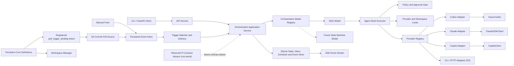

# Multi-Agent 主流编码 Agent 任务编排方案

> 状态：P0-P3 已实现；DAG、持久化事件入口、Git 分支提交检测、Cron/interval/一次性计划、Generic Webhook 和内部系统事件已完成 Fake/本地验证。GitHub、GitLab、Jenkins、Jira 连接器暂无测试环境，保持冻结不注册。Codex/OpenCodex 只读真实调用已验证，Claude、Copilot 仍为 Fake/mock。Pi 只保留未接线的契约顾问扩展点，不参与当前运行时。
> 方案版本：v0.9（2026-08-12）

## 1. 结论

已实现一个轻量、可持久化、由代码控制的任务编排内核，通过 Provider Adapter 接入各家编码 Agent SDK。

Pi 的定位被严格限制为未来的契约顾问：检查约定的输入/输出契约，提出小范围规范化建议，给出准入/准出意见，并且只能从应用预先声明的下一步候选 ID 中推荐。Pi 不生成 DAG 或 TaskSpec，不选择 Provider、模型、prompt、工作区、权限、工具、重试、会话或并发参数，也不能提交或触发运行。当前版本只保留该精简接口和 Fake 测试，主应用及 HTTP API 均未调用 Pi。

第一阶段支持三个具有官方 Python SDK 的编码 Agent：

- OpenAI Codex Python SDK
- Anthropic Claude Agent SDK
- GitHub Copilot SDK

Gemini CLI、OpenCode、Cursor、Kiro 等没有同等级 Python Agent SDK 或主要暴露 CLI/HTTP 接口的产品，放到第二阶段，通过独立的 CLI/HTTP Adapter 接入，不混入首版 SDK 核心。

全局工作流不交给任何 LLM 自由调度。编排模型由 `OrchestrationModelRegistry` 管理，当前注册确定性 DAG；后续状态机使用同一生命周期和执行内核，但拥有独立的定义解析及状态推进逻辑。工作流模板是可编辑、可版本化的编排定义；工作流实例是某个模板版本或临时定义的一次不可变执行。定义必须通过模型 schema、Provider 能力和工作区白名单校验；既可以通过 `POST /api/v1/instances` 创建临时实例，也可以通过 `/api/v1/templates/{id}/instances` 从已保存模板创建实例。

外部事件必须先进入持久化 Event Inbox，再由 Trigger Binding 做来源、事件类型、版本、过滤、输入映射和并发策略判断。事件源不能直接调用执行引擎。事件类型、事件源、计划类型和计划动作都通过代码注册表扩展；当前生产配置注册手动推送源、Generic Webhook、内部系统事件源、计划合成事件源、Git 提交轮询源、`git.commit.updated@1`、`webhook.received@1`、`schedule.tick@1`、内部工作流/审批/调度事件、五字段 Cron、interval、one_time、`poll_trigger_binding` 和 `publish_trigger_event` 动作，Fake 源只用于自动化测试。GitHub、GitLab、Jenkins、Jira 专用连接器在具备测试环境前不注册。

## 2. 仓库现状与边界

当前仓库是多个相互独立的本地 Python 工具集合：

- 根目录共享 `.venv` 和 `requirements.txt`。
- `codex_sessions` 是只读查询本地 Codex 会话的 FastAPI 工具。
- 新的 `multi-agent` 与 `codex_sessions` 并列，不依赖或修改其内部实现。

由于 `multi-agent` 含连字符，不能直接作为 Python import 包名。实现阶段建议在该目录内使用 `multi_agent` 作为 Python 包名：

```text
multi-agent/
  README.md
  multi_agent/
  tests/
```

实现保持独立工具边界，不修改 `codex_sessions`。通用 Web 依赖仍由根目录统一维护；三个真实 Agent SDK 使用本目录中的可选、精确版本依赖清单，Fake 测试不会安装或加载它们。

## 3. 目标与非目标

### 3.1 目标

- 用统一 API 提交、查询、取消和恢复多 Agent 任务。
- 支持顺序、并行、汇合、条件跳过等 DAG 编排能力。
- 保留每家 Agent 的会话 ID，实现后续续接。
- 统一任务级事件、状态和结果，但保留 Provider 原始事件供审计与排障。
- 对工作目录、写权限、并发写入和人工审批实施服务端控制。
- 进程重启后能够恢复工作流状态，避免任务只存在于内存。
- 允许以后增加新 Provider，而不修改调度核心。

### 3.2 非目标

- 不把不同厂商的所有会话、事件、工具和权限参数强行统一。
- 不在首版实现自动代码合并、自动解决冲突或无人值守发布。
- 不在首版建设分布式集群、Redis 队列或 Kubernetes 调度。
- 不接受客户端直接传入任意本机路径。
- 不把模型 API SDK（只负责生成内容）等同于完整编码 Agent SDK（包含工具循环、文件操作和会话管理）。

## 4. Provider 选择

| Provider | 官方接入方式 | 首版定位 | 关键能力与约束 |
| --- | --- | --- | --- |
| Codex | `openai-codex` Python SDK | P1 | 每个任务使用独立 `AsyncCodex`/CLI 生命周期；支持 thread 创建/恢复、流式 turn、steer、interrupt 和 sandbox。任务结束或取消后关闭客户端，允许不同任务并行使用不同模型。SDK 当前为 beta，发布包带固定版本的 Codex runtime。 |
| Claude Agent | `claude-agent-sdk` Python SDK | P1 | 连续任务使用 `ClaudeSDKClient`；支持 session、stream、interrupt、hooks、MCP、权限回调和结构化输出。第三方服务使用 API key，不转供 Claude 登录态。 |
| GitHub Copilot | `github-copilot-sdk` Python SDK | P1 | 使用应用级 `CopilotClient`；支持 session 创建/恢复、事件流、工具权限钩子和 abort。SDK 当前为 public preview，需要版本锁定和适配测试。 |
| Gemini CLI | Headless CLI + JSON | P2 | 官方 headless 模式适合自动化，但不是同等级 Python Agent SDK；使用子进程 Adapter，不能冒充原生 SDK Provider。 |
| OpenCode | HTTP/OpenAPI server | P2 | 使用独立 HTTP Adapter；会话、事件和权限按其服务协议处理。 |

Pi 不注册为执行 Provider。仓库保留一个基于 `pi --mode rpc` 的契约顾问 Adapter，但它当前未被主应用实例化或通过 HTTP 暴露。未来启用时，每次评估使用独立、无持久会话的 Pi 进程，并禁用内置工具、扩展、技能、prompt template、主题、项目上下文和项目级信任。

不建议直接把 OpenAI Agents SDK 当成跨厂商运行时。它适合模型 Agent 的 tools、handoffs、guardrails 和 tracing，也可以通过 MCP 调用 Codex；但 Claude Agent SDK、Copilot SDK 等仍有各自的进程、会话、权限和取消语义。首版保持自有轻量调度内核；以后即使引入模型侧顾问，它也只能处于契约边界，不能成为状态机或任务队列的控制者。

## 5. 总体架构



### 5.1 各层职责

- API Service：参数校验、身份信息、HTTP/SSE，不执行编排逻辑。
- Reserved Pi Contract Advisor：只做输入/输出契约意见、简单值调整和预声明下一步 ID 推荐；当前未接线。
- Application Service：模板、实例、审批、取消和事件触发的唯一用例入口。
- Orchestration Model Registry：按 `kind` 解析、校验、物化并运行编排定义；当前只有 `dag`。
- DAG Model：只负责依赖满足、并行分支、失败传播和 DAG 最终状态。
- Agent Work Executor：只负责 Agent 调用、Provider 配额、工作区锁、超时、重试、会话和审批，不决定编排路径。
- Trigger Service：持久化事件去重、绑定匹配、过滤、输入映射、并发准入和投递恢复。
- Policy and Approval Gate：统一表达安全意图，再映射到各 Provider 的实际能力。
- Provider Adapter：SDK 生命周期、参数转换、会话续接、事件归一化和取消。
- Workspace Manager：路径白名单、访问模式、写锁，以及后续的 Git worktree 隔离。
- SQLite Store：可编辑模板、不可变实例快照、通用 WorkItem、尝试、会话引用、审批、运行事件、触发事件和投递记录。

## 6. 核心数据模型

### 6.1 WorkflowDefinition

- `id` / `version`
- `name`
- `tasks: list[TaskSpec]`
- `max_concurrency`
- `failure_policy`: `fail_fast` 或 `continue_independent`

工作流定义在开始运行后生成不可变快照。后续修改模板不会改变已经开始的运行。

保存的工作流模板使用 `id + version` 做乐观并发控制。模板与其中的任务、依赖和契约以完整 JSON 原子保存；名称、任务数和时间单独存储用于列表查询。删除操作只归档模板，不删除历史工作流实例。SQLite 只维护当前 schema 基线，不保留历史迁移链；检测到旧表、旧版本记录或不完整结构时拒绝启动，必须使用新的数据库重新初始化。

### 6.2 TaskSpec

- `id`
- `depends_on`
- `provider`
- `role`
- `prompt_template`
- `workspace_id`
- `access`: `read_only`、`workspace_write`
- `session_mode`: `new`、`resume`
- `output_schema`
- `timeout_seconds`
- `retry_policy`
- `provider_options`

`provider_options` 是受 Adapter 校验的逃生舱，用于承载厂商特有参数。通用核心不需要随着每家 SDK 新增参数而频繁修改。

### 6.3 WorkflowInstance / WorkItem / ExecutionAttempt

- WorkflowInstance：某个模板版本或临时定义的一次不可变执行。
- WorkItem：编排模型物化出的可执行单元，使用 `logical_key + activation_number` 标识；DAG 的首轮 Task 是 activation 1。
- ExecutionAttempt：某次真实 Provider 调用，包含 `provider_session_id`、开始/结束时间、错误分类和用量。

实例同时保存 `kind`、定义 schema 版本、输入、运行时状态、revision 和触发因果 ID。重试创建新的 ExecutionAttempt，不覆盖之前的调用证据。

### 6.4 TriggerEvent / TriggerBinding / TriggerDelivery

- TriggerEvent：外部事件收件箱记录，`source_type + dedup_key` 唯一。
- TriggerBinding：把来源类型、事件类型、可选 source key 和过滤规则绑定到模板，并定义输入映射及并发策略。
- TriggerDelivery：事件到绑定的一次持久化投递，唯一键为 `event + binding`，状态为 `pending`、`delivered`、`skipped` 或 `failed`。

事件接收采用至少一次语义，数据库唯一约束保证同一事件和绑定不会重复创建实例。`skip_if_running` 可在目标模板已有排队或运行实例时记录为跳过；默认策略为 `allow_parallel`。

### 6.4 AgentEvent

统一事件信封只包含稳定字段：

```text
event_id
workflow_instance_id
work_item_id
execution_attempt_id
provider
kind
occurred_at
summary
payload
raw_event_type
```

`kind` 首版只定义：`started`、`message_delta`、`message_completed`、`tool_started`、`tool_completed`、`approval_required`、`usage`、`completed`、`failed`、`cancelled`。

Provider 原始事件写入 `payload` 前必须做密钥和敏感字段清理。UI 只依赖稳定字段，排障工具可以查看脱敏后的 Provider 细节。

## 7. Provider Adapter 合约

概念接口如下，具体命名在实现阶段再定：

```python
class AgentProvider(Protocol):
    def capabilities(self) -> ProviderCapabilities: ...

    async def start(self) -> None: ...
    async def close(self) -> None: ...

    async def create_session(
        self, request: ExecutionRequest
    ) -> ProviderSessionRef: ...

    async def resume_session(
        self, session: ProviderSessionRef, request: ExecutionRequest
    ) -> ExecutionHandle: ...

    async def stream(
        self, handle: ExecutionHandle
    ) -> AsyncIterator[AgentEvent]: ...

    async def steer(self, handle: ExecutionHandle, prompt: str) -> None: ...
    async def cancel(self, handle: ExecutionHandle) -> None: ...
```

`ProviderCapabilities` 至少声明：

- `resume_session`
- `stream_events`
- `steer_running_turn`
- `cancel_running_turn`
- `structured_output`
- `approval_callback`
- `read_only_mode`
- `workspace_write_mode`

启动任务前先做能力协商。工作流要求某能力而 Provider 不支持时，任务在调用 SDK 前就以配置错误失败，不能静默降级成更危险或语义不同的模式。

## 8. 编排与并发规则

### 8.1 调度算法

1. 校验任务 ID、依赖引用和 DAG 无环性。
2. 持久化工作流实例快照和初始 TaskInstance。
3. 将依赖全部成功的任务标记为 `ready`。
4. 检查 Provider 能力与策略。
5. 获取全局并发槽、Provider 并发槽和工作区锁。
6. 创建或恢复 Provider session，立即持久化其 ID。
7. 消费 SDK 事件，先落库再推送 SSE。
8. 根据结果推进依赖任务，或按 failure policy 阻断下游。
9. 释放锁并写入最终状态。

### 8.2 并发约束

- 全局并发限制防止本机进程和 API 配额失控。
- 每个 Provider 单独配置并发上限。
- 同一个 Provider session 的 turn 必须串行。
- 同一个工作区允许多个只读任务并行。
- 同一个工作区最多一个写任务运行。
- 读任务是否能与写任务同时运行默认禁止，避免读到中间状态。

### 8.3 写入隔离

首版采用 `shared_serial`：写任务在用户指定工作区串行运行，适合包含未提交修改的仓库，且行为最容易解释。

后续增加 `isolated_worktree`：仅对干净且满足 Git 前置条件的仓库，为并行写任务创建独立 worktree。首版不自动合并多个 Agent 的提交；合并必须是显式任务或人工步骤。

## 9. 状态机、失败与恢复

TaskInstance 状态为：

```text
pending -> ready -> running -> succeeded
                    |   |
                    |   +-> awaiting_approval -> running
                    +-----> failed
                    +-----> cancelled
                    +-----> interrupted
pending/ready ----------------> blocked
```

规则：

- Provider 鉴权、配置、权限拒绝和业务失败使用不同错误码。
- 只读且确认幂等的任务可以自动重试。
- 写任务在结果未知时不自动重试，避免重复修改；先标记 `interrupted` 并等待恢复或人工决定。
- 进程启动时，将遗留的 `running` 标记为 `interrupted`。
- Provider 支持续接且已保存 session ID 时，可创建新 Attempt 继续原会话。
- 不支持可靠续接时，必须显式从头重跑，不能伪装成恢复。

## 10. 权限与安全模型

### 10.1 工作区

- API 只接收 `workspace_id`，服务端映射到白名单绝对路径。
- 映射时解析规范路径并校验其仍位于允许根目录内。
- 拒绝客户端直接提交 `cwd`、额外可写根目录或任意可执行文件路径。

### 10.2 统一访问意图

- 默认 `read_only`。
- `workspace_write` 必须由工作流定义显式声明。
- `full_access` 首版不暴露给普通 API。

Adapter 将统一访问意图映射到 Provider 的原生 sandbox/permission 配置；如果无法等价映射，则拒绝执行，而不是使用自动批准或无沙箱模式代替。

### 10.3 审批

- Provider 的权限请求转为持久化 `ApprovalRequest`。
- TaskInstance 进入 `awaiting_approval`，通过 SSE 通知客户端。
- 批准或拒绝必须包含用户、时间、范围和理由。
- 默认一次批准只覆盖一次具体工具调用；批量规则属于后续能力。

### 10.4 凭据

- SDK key/token 从服务端环境或密钥管理系统读取。
- 数据库不保存密钥，事件和日志不输出密钥。
- 不将 Agent 消费者账号登录态转供给未经授权的第三方用户。

## 11. API 草案

```http
POST   /api/v1/templates/validate
POST   /api/v1/templates
GET    /api/v1/templates
GET    /api/v1/templates/{template_id}
PUT    /api/v1/templates/{template_id}
DELETE /api/v1/templates/{template_id}
POST   /api/v1/templates/{template_id}/instances
GET    /api/v1/orchestration-models
GET    /api/v1/coordinator
POST   /api/v1/instances
GET    /api/v1/instances
GET    /api/v1/instances/{instance_id}
GET    /api/v1/instances/{instance_id}/work-items
GET    /api/v1/instances/{instance_id}/tasks
GET    /api/v1/instances/{instance_id}/events
POST   /api/v1/instances/{instance_id}/cancel
GET    /api/v1/instances/{instance_id}/approvals
POST   /api/v1/approvals/{approval_id}/approve
POST   /api/v1/approvals/{approval_id}/reject
GET    /api/v1/providers
GET    /api/v1/workspaces
GET    /api/v1/event-source-types
GET    /api/v1/event-types
GET    /api/v1/schedule-types
GET    /api/v1/scheduled-action-types
POST   /api/v1/triggers
GET    /api/v1/triggers
GET    /api/v1/triggers/{binding_id}
PUT    /api/v1/triggers/{binding_id}
DELETE /api/v1/triggers/{binding_id}
POST   /api/v1/triggers/{binding_id}/enable
POST   /api/v1/triggers/{binding_id}/disable
POST   /api/v1/triggers/{binding_id}/poll
POST   /api/v1/events
POST   /api/v1/hooks/webhook/{endpoint_key}
GET    /api/v1/events
GET    /api/v1/events/{event_id}
POST   /api/v1/events/{event_id}/retry
POST   /api/v1/scheduled-tasks
GET    /api/v1/scheduled-tasks
GET    /api/v1/scheduled-tasks/{task_id}
PUT    /api/v1/scheduled-tasks/{task_id}
DELETE /api/v1/scheduled-tasks/{task_id}
POST   /api/v1/scheduled-tasks/{task_id}/enable
POST   /api/v1/scheduled-tasks/{task_id}/disable
POST   /api/v1/scheduled-tasks/{task_id}/run
GET    /api/v1/scheduled-tasks/{task_id}/runs
GET    /health
```

事件接口使用 SSE，并支持 `Last-Event-ID` 从 SQLite 中补发断线期间的事件。取消接口是幂等操作。

模板和实例列表使用稳定游标分页。模板更新必须提交当前 `version`；版本过期返回 `409 workflow_template_version_conflict`。`GET /coordinator` 只报告 Pi 扩展点为 `enabled=false`、`invocation=not_wired`，不会启动 Pi。当前没有 plan、replan 或 Pi 契约评估 HTTP 接口。

## 12. 目录规划

```text
multi-agent/
  README.md
  requirements-agents.txt
  examples/
    addition_pipeline/
      inputs/
      README.md
      workflow.json
  multi_agent/
    __init__.py
    main.py
    api/
      routes.py
      schemas.py
    domain/
      models.py
      errors.py
    orchestration/
      contracts.py
      registry.py
      dag.py
      execution.py
      engine.py
      service.py
    triggers/
      events.py
      sources.py
      service.py
    scheduling/
      drivers.py
      service.py
    coordination/
      base.py
      models.py
      pi.py
      pi_rpc.py
      service.py
    providers/
      base.py
      registry.py
      utils.py
      fake.py
      codex.py
      claude.py
      copilot.py
    storage/
      schema.py
      schedule_sqlite.py
      sqlite.py
      trigger_sqlite.py
    workspaces/
      manager.py
  tests/
    test_models.py
    test_storage.py
    test_workspaces.py
    test_engine.py
    test_adapters.py
    test_api.py
    test_pi_rpc.py
    test_pi_advisor.py
    test_coordination.py
```

不为每个 Provider 复制完整业务层。Provider 目录只处理厂商协议；编排路径只存在于具体 Orchestration Model，Agent 执行策略只存在于 `AgentWorkExecutor`，事件源只产生标准事件。Pi、Provider 和事件源都不能直接改变实例状态或绕过应用服务。

## 13. 分阶段实施

### P0：编排骨架（已完成 Fake 验证）

- 定义领域模型、状态机和 Adapter Protocol。
- SQLite 持久化和单一 schema 基线。
- FakeProvider 合约测试。
- 顺序 DAG、并行 DAG、取消和重启恢复测试。

### P1：三个原生 SDK Provider（Codex 真实只读验证完成）

- Codex Adapter 完成第一条端到端纵切。
- Claude Adapter 与 Copilot Adapter 通过同一组合约测试。
- 实现 session ID 持久化、事件归一化、权限映射和取消。
- SDK 版本锁定，不使用宽泛的无上限版本范围。
- Codex 已通过 Scoop CLI + OpenCodex 使用显式 task model/effort 完成真实纵向测试；Claude、Copilot 仍待真实 runtime 验证。

### P2：FastAPI 与人工审批（已完成 Fake 验证）

- 运行管理 API、SSE、`Last-Event-ID`。
- 工作区白名单和并发写锁。
- 审批请求与恢复执行。
- 真实 SDK 冒烟测试放在显式 integration 标记下，常规单元测试不消耗外部额度。

### P3：编排模型框架与事件入口（已完成 Fake 验证）

- DAG 从 WorkflowEngine 内部调度代码抽为已注册的 `DagOrchestrationModel`。
- Agent 调用、重试、审批、会话锁和工作区锁抽为独立执行内核。
- SQLite 基线为 schema v5：模板和实例持久化 `kind`，TaskInstance 泛化为 WorkItem，并包含事件版本、计划定义、内部事件 Outbox、Webhook 唯一索引和计划运行历史。
- 完成 Event Inbox、Trigger Binding、Trigger Delivery、输入映射、过滤、并发准入、去重与待投递恢复。
- 完成手动推送事件源、Git 提交轮询源和 Fake 轮询事件源。
- 完成代码注册的事件类型目录、计划类型目录和计划动作目录。
- 完成持久化 Cron 定义、启停、手动运行、运行历史、重启重建计时器和中断运行恢复。
- 完成 Generic Webhook：HMAC 签名、IP 白名单、流式 payload 限制、长度安全的 dedup 键、带时间窗口的 body 去重、数据库唯一 endpoint 约束与 `POST /api/v1/hooks/webhook/{endpoint_key}`。
- 完成 `interval` / `one_time` 计划驱动和 `publish_trigger_event` 动作，计划合成事件统一走 `schedule.tick@1`；过期 one-time 会记录失败运行并自动停用。
- 完成内部系统事件：实例创建/状态、审批、计划运行结果和投递失败，支持自触发与级联深度保护；状态变更与 outbox 同事务提交，启动时自动恢复未发布事件。

### P4：Provider 与运行增强（Pi 契约顾问仅预留接口）

- 已保留 Pi JSONL RPC 客户端、`ContractAdvisor`、窄化响应 schema 和确定性契约复核，并完成 Fake 测试。
- 当前主应用不实例化、不调用 Pi，HTTP API 也不暴露契约评估或工作流生成入口。
- 后续阶段再设计由应用拥有的任务模板、候选下一步集合和显式启用开关；Pi 仍不得生成执行细节。

- 状态机编排模型、RuntimeSignal 和持久化 Timer。
- Gemini CLI Adapter。
- OpenCode HTTP Adapter。
- Git worktree 隔离模式。
- OpenTelemetry、成本统计、Provider 熔断和多进程锁。

## 14. 验收标准

- 一个三节点工作流可以先分析，再并行执行两个只读任务，最后汇总。
- Codex、Claude、Copilot 使用相同任务合约运行，但各自保存原生 session ID 和原始事件类型。
- 同一工作区不会出现两个并发写任务。
- 同一 session 不会出现并发 turn。
- 进程重启后，已完成任务不重复执行，未完成任务可被识别为 `interrupted`。
- 取消请求会落库，并调用 Provider 的取消能力；不支持强取消时明确报告能力限制。
- 不在白名单内的工作目录在调用任何 SDK 前被拒绝。
- Provider 不支持所需权限语义时快速失败，不静默扩大权限。
- SSE 断线后可以通过 `Last-Event-ID` 补发事件。
- 单元测试使用 FakeProvider；真实 Provider 测试单独运行且不泄露凭据。

## 15. 主要风险与对策

| 风险 | 对策 |
| --- | --- |
| SDK 仍处于 beta/preview，接口变化 | 锁定版本；Provider 合约测试；升级一次只改一个 Adapter。 |
| 各家事件和权限语义不一致 | 只统一稳定最小集合；保留原始事件；启动前做能力协商。 |
| Agent 并发修改同一仓库造成冲突 | 首版单写者锁；后续引入 worktree；不自动合并。 |
| SDK 子进程退出或主服务重启 | Attempt 持久化；session ID 尽早落库；`interrupted` 恢复流程。 |
| 自动重试导致重复代码修改 | 默认只自动重试幂等只读任务；写任务结果未知时转人工处理。 |
| 客户端通过路径或工具参数越权 | 服务端 workspace allowlist；规范路径检查；Provider 参数白名单。 |
| 某个 Provider 不可用拖垮全局 | Provider 独立并发池、超时、健康状态和熔断；独立任务失败策略。 |

## 16. 已确认的设计决策

实现采用以下已确认默认值：

1. 产品范围：编排“编码 Agent”，不是通用聊天 Agent。
2. 首版 Provider：Codex、Claude Agent SDK、GitHub Copilot SDK。
3. 编排方式：确定性 DAG 为唯一权威控制面；Pi 未来只提供契约意见、简单输入输出调整和预声明候选推荐，当前不接线。
4. 部署方式：Windows 本机、单 FastAPI 进程、SQLite；先不引入 Redis/Celery。
5. 写入策略：同一工作区单写者串行；Git worktree 延后。
6. 默认权限：只读；写权限逐任务显式开启；不开放 full access。

## 17. 当前实现与使用

### 17.1 已实现

- Pydantic 工作流、任务、权限、重试和事件模型。
- DAG 校验、顺序/并行/汇合调度和失败传播。
- SQLite WorkflowInstance、TaskInstance、ExecutionAttempt、Event、Approval 持久化。
- 进程启动时将遗留 `running` / `awaiting_approval` 状态恢复为 `interrupted`。
- 同工作区多读者/单写者锁，以及同 Provider session 串行锁。
- FakeProvider、Codex、Claude、GitHub Copilot Adapter。
- SDK 延迟导入：服务健康检查和 Fake 测试不会启动真实 SDK。
- FastAPI 运行、任务、取消、审批、Provider、工作区和 SSE 接口。
- SSE `Last-Event-ID` 补发。
- Prompt 支持 `{{dependencies}}` 和 `{{tasks.<dependency_id>.output}}`。
- 未接线的 Pi JSONL RPC 客户端和 `ContractAdvisor` 预留扩展点。
- Pi 输出只能是 `admit/reject/revise`、原因码、可选规范化值和预声明下一步 ID；Fake 测试证明它不能返回 workflow/task 字段。
- 确定性代码会复核值类型、必需/允许字段、序列化大小和下一步 ID 白名单；该服务当前不进入主应用运行路径。
- Codex 服务级 `codex_bin` / `codex_home` 配置，以及任务级 `model` / `effort` 显式传递。
- 核心通过短生命周期 Codex SDK/app-server 的 `model/list` 读取当前有效模型目录，而不是直接解析某一种目录 JSON。该路径统一支持 OpenAI 原生目录、CC Switch 投影目录和 OpenCodex 投影目录，并保留 app-server 返回的推理等级顺序。`GET /api/v1/providers` 发布模型类型、模型、适用推理等级、环境类型和目录 revision；Codex Adapter 在每个任务启动前重新发现并拒绝目录外模型及不匹配的 effort。
- `model_provider`、base URL、Codex Home 和底层 `config` 是服务端信任配置，任务只能显式选择目录内完整 model slug 与适用 effort，不能通过 `provider_options` 覆盖 Provider 路由或任意 Codex 配置。
- Codex `output_schema` 按 Structured Outputs 的严格子集校验：根节点必须是 object，每个 object 都要声明 `additionalProperties: false`，`required` 必须覆盖全部 properties，array 必须声明 `items`。核心在启动 CLI 前以稳定错误码 `invalid_output_schema` 拒绝不合规 Schema。
- Provider 目录对单个 Provider 的模型目录错误做隔离，异常 Provider 会标记为不可用，不再拖垮整个 `/api/v1/providers`。
- Provider 流必须给出真实 terminal event；Codex/Claude 提前断流会由编排器判定为 `incomplete_provider_stream`，不会伪造成功。任务超时会先 interrupt Provider，再记录可重试的 timeout。
- 重启恢复会把 queued/running WorkflowInstance 下所有非终态任务标记为 interrupted，并系统拒绝已经失去执行句柄的 pending approval；已完成实例、session lock 与运行任务引用会及时释放。
- Codex app-server `agentMessage` delta/completed 事件解析和真实失败消息提取。

### 17.2 安装通用依赖

在仓库根目录执行：

```powershell
python -m venv .venv
.venv\Scripts\python.exe -m ensurepip --upgrade
.venv\Scripts\python.exe -m pip install -r requirements.txt
```

真实 Provider SDK 是可选项。需要进行真实集成时再安装：

```powershell
.venv\Scripts\python.exe -m pip install -r multi-agent\requirements-agents.txt
```

### 17.3 配置与启动

`MULTI_AGENT_WORKSPACES` 必须是由客户端可见 ID 到服务端绝对路径的 JSON 对象。客户端只能提交 ID，不能提交任意 `cwd`：

```powershell
$env:MULTI_AGENT_WORKSPACES = '{"aitools":"D:\\dev\\AITools"}'
$env:MULTI_AGENT_STATE_DB = 'D:\dev\AITools\multi-agent\data\state.sqlite3'
$env:MULTI_AGENT_CODEX_BIN = 'C:\Users\liujian\scoop\shims\codex.exe'
$env:MULTI_AGENT_CODEX_HOME = 'C:\Users\liujian\.codex'
.venv\Scripts\python.exe -m uvicorn multi_agent.main:app --app-dir multi-agent --host 127.0.0.1 --port 8010
```

如果没有设置 `MULTI_AGENT_WORKSPACES`，服务只注册启动进程的当前目录为 `default`。

`MULTI_AGENT_CODEX_BIN` 用于明确选择宿主 Codex CLI；`MULTI_AGENT_CODEX_HOME` 是服务端信任配置，不能由任务/API 客户端覆盖。Codex Home 的自动定位顺序为 `MULTI_AGENT_CODEX_HOME`、进程 `CODEX_HOME`、CC Switch `~/.cc-switch/settings.json` 中的 `codexConfigDir`、默认 `~/.codex`。使用 OpenCodex 时先运行 `ocx ensure`，让基础 `config.toml` 注入本地代理和模型目录。每次网页目录刷新使用独立的短生命周期 app-server，因此无需重启 Multi-Agent 核心；已经运行的其它 Codex Desktop/CLI 进程是否需要重启由它们自己的目录缓存决定。

### 17.4 Fake 测试

```powershell
$env:PYTHONPATH = "$PWD\multi-agent"
.venv\Scripts\python.exe -B -m unittest discover -s multi-agent\tests -t multi-agent -v
```

测试只使用 FakeProvider、注入的 SDK mock 和 Fake Pi JSONL 进程，不读取 API key、不登录厂商账号、不调用模型。Pi 契约顾问测试直接测试预留接口，主应用不会实例化或调用它。

### 17.5 Pi 预留契约（当前未接线）

```json
{
  "phase": "output",
  "contract": {
    "name": "analysis_output",
    "value_type": "object",
    "required_fields": ["summary"],
    "allowed_fields": ["summary"],
    "max_serialized_bytes": 65536
  },
  "value": {"summary": "分析完成"},
  "candidate_next_steps": [
    {"id": "review", "description": "进入应用预先定义的复核模板"}
  ]
}
```

这只是内部 `ContractCheckRequest` 的接口形状，不存在对应 HTTP 调用。即使未来启用，Pi 也只能返回契约判断、小范围规范化值以及上述候选中的 ID；任务模板和一切执行参数仍由应用代码持有。

### 17.6 真实 Provider 边界

- Codex 任务通过 `provider_options.model` 和 `provider_options.effort` 显式选择模型；例如 `{"model":"sensenova/deepseek-v4-flash","effort":"high"}`。OpenCodex 的 `provider/model` 必须作为完整 model slug 传递，不能拆成 Codex `model_provider`。
- Codex 每个任务创建独立 `AsyncCodex`/CLI 客户端，并在流结束、失败或取消时释放；同一运行内的不同任务可以并行使用各自显式指定的模型和 effort。sandbox 映射到 `read_only` / `workspace_write`。
- Claude 每个会话使用独立 `ClaudeSDKClient`；只读任务只暴露 Read/Glob/Grep，写入与外部工具通过审批回调。
- Copilot 使用一个应用级 `CopilotClient`；每个任务创建或恢复 session，事件回调转为异步事件流。Fake 阶段只开放 `view` / `grep` / `glob`，在真实 runtime 隔离验证完成前拒绝 `workspace_write`。
- 三个 SDK 都采用精确版本；升级时先更新对应 Adapter fake contract test，再进行单独的真实 smoke test。

### 17.7 Codex 真实集成测试

真实测试默认跳过，必须显式提供服务端 CLI、Codex home 和获准模型：

```powershell
$env:PYTHONPATH = "$PWD\multi-agent"
$env:RUN_REAL_CODEX_TESTS = '1'
$env:REAL_CODEX_BIN = 'C:\Users\liujian\scoop\shims\codex.exe'
$env:REAL_CODEX_HOME = 'C:\Users\liujian\.codex'
$env:REAL_CODEX_WORKSPACE = "$PWD"
$env:REAL_CODEX_MODEL = 'sensenova/deepseek-v4-flash'
$env:REAL_CODEX_EFFORT = 'high'
.venv\Scripts\python.exe -B -m unittest tests.integration.test_codex_real -v
```

2026-08-08 的验证通过完整 `WorkflowEngine -> CodexProvider -> openai-codex SDK -> Scoop Codex CLI -> OpenCodex` 链路，run/task 成功、Provider session ID 已持久化、最终输出包含 `CODEX_REAL_SMOKE_OK`，测试前后 `multi-agent` 文件树 SHA-256 相同。SDK 0.144.4 在 Windows 关闭子进程时仍输出两个上游 `ResourceWarning`，不影响任务结果。

## 18. 官方资料

- [OpenAI Codex SDK](https://developers.openai.com/codex/sdk)
- [OpenAI Agents SDK - Agent orchestration](https://openai.github.io/openai-agents-python/multi_agent/)
- [Anthropic Claude Agent SDK overview](https://code.claude.com/docs/en/agent-sdk/overview)
- [Anthropic Claude Agent SDK Python reference](https://code.claude.com/docs/en/agent-sdk/python)
- [GitHub Copilot SDK getting started](https://docs.github.com/en/copilot/how-tos/copilot-sdk/getting-started)
- [GitHub Copilot SDK streaming events](https://docs.github.com/en/copilot/how-tos/copilot-sdk/use-copilot-sdk/streaming-events)
- [Gemini CLI headless mode](https://google-gemini.github.io/gemini-cli/docs/cli/headless.html)
- [OpenCode server](https://dev.opencode.ai/docs/server/)
- [Pi coding agent](https://github.com/earendil-works/pi/tree/main/packages/coding-agent)
- [Pi SDK](https://github.com/earendil-works/pi/blob/main/packages/coding-agent/docs/sdk.md)
- [Pi RPC protocol](https://github.com/earendil-works/pi/blob/main/packages/coding-agent/docs/rpc.md)
- [OpenCodex](https://github.com/lidge-jun/opencodex)
